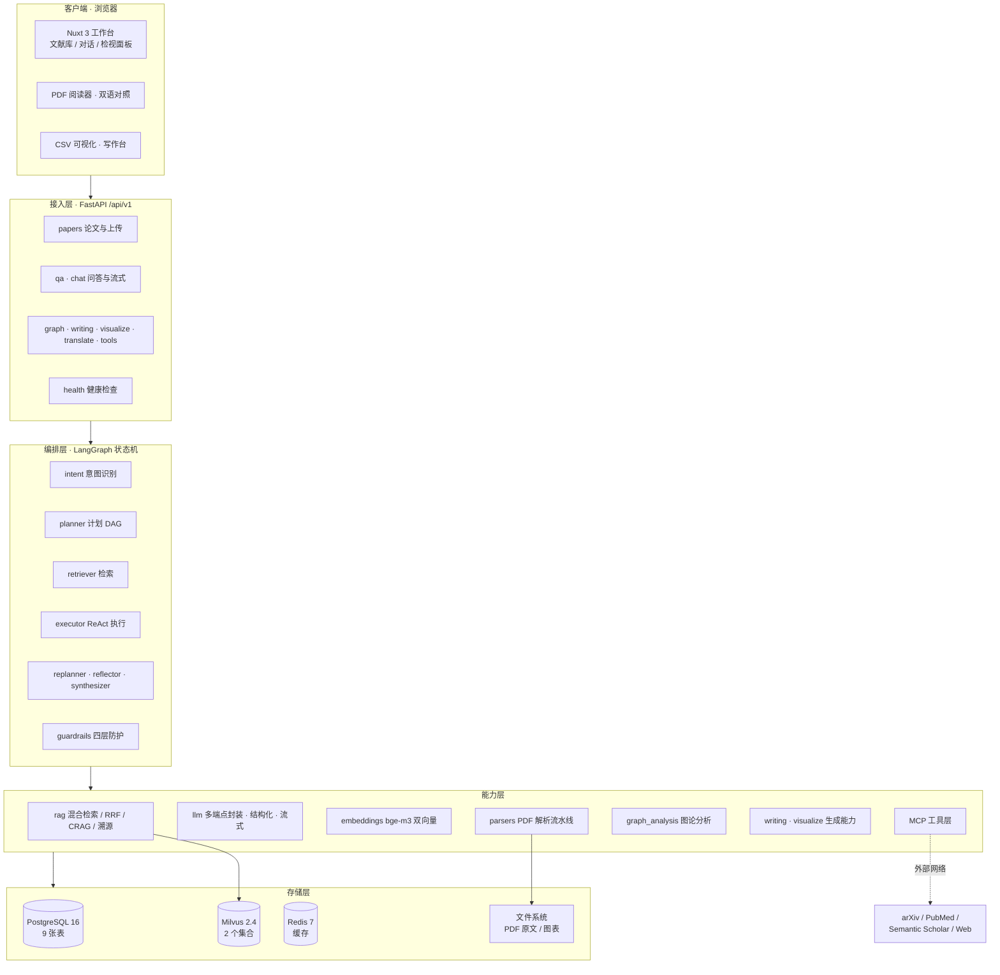
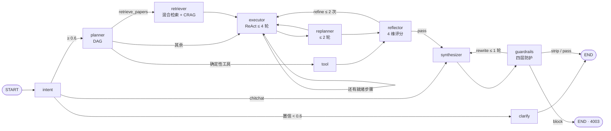

# Research Copilot

> 面向科研语料的**单机多智能体研究助手**：把本地 PDF 论文变成可检索、可溯源、可推理的知识库，
> 在同一个工作台里完成问答、跨篇综述、引文图谱分析、图表生成与中英互译。

```
PDF → bge-m3 双向量 → Milvus 混合检索 + RRF → CrossEncoder 重排
    → LangGraph 三范式编排（Plan-and-Execute / ReAct / Reflection）
    → 带句级溯源（页码 + bbox）的流式回答
```

**它不是「PDF + 大模型」的问答壳子。** 系统里每一个输出都必须能指回原文的**具体页码与坐标框**，
每一条引用都要过**白名单 + NLI 蕴含验证**，模型编造的引用会被机械地拦下来。

技术栈：Nuxt 3 + FastAPI + LangGraph + Milvus 2.4 + PostgreSQL 16 + Redis 7 + MinerU。
外部工具（arXiv / PubMed / Semantic Scholar / Python 沙箱 / Web Search）统一封装为 MCP Server。
长任务（PDF 解析入库、引文边重建）**在 backend 进程内**的后台线程执行，**不依赖 Celery / 独立 worker 容器**。

| 指标 | 值 |
|:---|:---|
| 后端 | 114 个模块 / 19,769 行 Python |
| 前端 | 35 个组件 / 12,400 行 Vue + TS |
| API | 46 条路径 / 50 个操作（带 `operation_id` 的同时是 MCP 工具） |
| 测试基线 | `pytest -m 'not model'` = **614 passed / 2 skipped / 10 deselected** |
| 部署组件 | 7 个容器（postgres / redis / etcd / minio / milvus / backend / frontend） |

---

## 技术架构



**Agent 图**（三范式融合在同一张可观测的图里，四处循环全部显式建边并各自限流）：



> 完整的架构图、Agent 图、MCP 集成图、数据模型 ER 图与 AI 技术选型实验，见
> [`docs/技术文档.md`](docs/技术文档.md)。

---

## 快速开始

### 前置条件

| 项 | 要求 |
|:---|:---|
| Docker | Docker Desktop / Engine **24+**，含 `docker compose` v2 |
| 内存 | **≥ 8GB**（Milvus standalone 单机建议预留 ≥ 4GB） |
| 磁盘 | ≥ 10GB（镜像 + bge-m3 权重 ≈ 2GB） |
| 网络 | 首次启动需拉镜像与 bge-m3 权重；后续可离线跑 |

### 三步启动

```bash
# 1) 准备配置（幂等：已存在则跳过，不覆盖）
cp .env.example .env          # 或 make init

# 2) 至少填两项 ★必改
#    LLM_API_KEY   —— DeepSeek / Qwen / OpenAI 任一 OpenAI 兼容端点的 key
#    SECRET_KEY    —— openssl rand -hex 32
$EDITOR .env

# 3) 一键拉起全部 7 个服务
docker compose up -d --build   # 或 make up
```

首次启动会拉取 **bge-m3（约 2GB）** 到 `models_cache` 卷，后续重建镜像不会重复下载。
全部服务 `healthy` 约需 **2–5 分钟**（Milvus 最慢）。

| 入口 | 地址 |
|:---|:---|
| 前端工作台 | http://localhost:3000 |
| API 文档（Swagger） | http://localhost:8000/docs |
| API 健康检查 | http://localhost:8000/health |
| 三库健康检查 | http://localhost:8000/api/v1/health/db |
| Milvus 指标 | http://localhost:9091/healthz |
| MCP 端点 | http://localhost:8000/mcp |

### 验收自检

```bash
docker compose ps                                              # 期望 7 个服务 running/healthy
curl -s localhost:8000/docs -o /dev/null -w '%{http_code}\n'   # 期望 200
curl -s localhost:8000/health | python -m json.tool            # postgres / milvus / mineru / llm 四项
curl -s localhost:3000 -o /dev/null -w '%{http_code}\n'        # 期望 200
```

`/health` 里某项为 `false` 不代表起不来：**顶栏「降级 N 项」= 后端活着但依赖挂了**，
「不可达」= 后端没起。降级路径全部如实暴露在日志、API 字段与前端 UI 三处。

### 常用命令

```bash
make ps                       # 看服务状态与健康
make logs                     # 跟踪全部日志；make logs S=backend 只看一个
make down                     # 停止（保留数据卷）
make restart                  # 重启 backend（改完 Python 代码常用）
```

---

## 目录结构

```
research-copilot/
├── backend/
│   ├── app/
│   │   ├── main.py               # FastAPI 入口 + 生命周期
│   │   ├── core/                 # 配置 / 日志 / 错误体系 / 安全
│   │   ├── api/v1/               # papers · qa · chat(SSE) · graph · writing · visualize · translate · tools · health
│   │   ├── models/ schemas/      # SQLAlchemy 2.0 模型 / Pydantic v2 模型
│   │   ├── agents/               # ★ LangGraph：state / graph / checkpointer / 节点 / prompts
│   │   │   └── mcp/              #   MultiServerMCPClient 封装 + 意图→工具白名单
│   │   ├── mcp_servers/          # ★ 5 个独立 FastMCP Server（arxiv/pubmed/s2/sandbox/web）
│   │   ├── rag/                  # ★ 混合检索 + RRF / CRAG 三级降级 / 溯源三方法融合
│   │   ├── llm/                  #   OpenAI SDK 统一封装（多端点 + 流式 + 结构化 + repair 重试）
│   │   ├── embeddings/           #   bge-m3 Dense(1024) + Learned Sparse，三条加载路径
│   │   ├── parsers/              # ★ MinerU 为主 + PyMuPDF / pdfplumber / pypdf 降级链
│   │   ├── indexing/             # ★ 进程内后台任务（pipeline / runner），替代原 workers/
│   │   ├── graph_analysis/       #   NetworkX 引文图 / 图论分析 / 领域综述
│   │   ├── writing/ visualize/   #   写作 Copilot（无幻觉 References）/ CSV 六图型
│   │   └── db/                   #   PostgreSQL / Milvus 连接与集合定义
│   ├── alembic/                  # 迁移脚本（手写，非全 autogenerate）
│   ├── benchmarks/               # ★ 实验脚本：检索消融 / CRAG 门控 / 图表生成
│   └── tests/                    # 614 个离线用例（-m 'not model'）
├── frontend/                     # Nuxt 3：pages / components / stores / composables / assets/css（设计 token）
│   └── scripts/                  # check:md（渲染层 6 项）/ check:sync（段落对齐 18 项）
├── docs/
│   ├── 技术文档.md                # ★ 架构 / Agent / RAG / MCP / 数据模型 / 实验（可导出 PDF）
│   └── figures/                  # 实验图表 PNG + 原始读数 JSON + 生成脚本
├── docker-compose.yml            # 7 个服务，单机网络 rc-net
├── Makefile                      # 幂等命令封装
└── .env.example                  # 环境变量模板（唯一提交的配置样本）
```

---

## 环境变量

完整清单与逐项说明见 [`.env.example`](.env.example) 与
[`docs/技术文档.md` 附录 C](docs/技术文档.md)。**必填**项只有两个：

| 变量 | 必填 | 默认 | 说明 |
|:---|:---:|:---|:---|
| `LLM_API_KEY` | ★ | `sk-REPLACE_ME` | OpenAI 兼容端点的 key |
| `SECRET_KEY` | ★ | `change-me-...` | `openssl rand -hex 32` |

其余按分组速查（改这些就能换厂商 / 调链路，**不需要改代码**）：

| 分组 | 关键变量 | 默认 | 说明 |
|:---|:---|:---|:---|
| 通用 | `ENV` / `LOG_LEVEL` / `MAX_UPLOAD_MB` | `development` / `INFO` / `100` | 单篇 PDF 上限 100MB |
| PostgreSQL | `POSTGRES_USER/PASSWORD/DB` | `copilot/copilot_pass/research_copilot` | 或 `DATABASE_URL` 覆盖 |
| Milvus | `MILVUS_HOST/PORT` · `MILVUS_LITE_PATH` | `localhost/19530` · 空 | 填路径走 milvus-lite（无需 Docker） |
| Redis | `REDIS_HOST/PORT/DB` | `localhost/6379/0` | 只做缓存，**不是任务队列** |
| LLM | `LLM_BASE_URL` · `LLM_MODEL_PLANNER/EXECUTOR/REVIEWER` | `deepseek-chat` | 三档角色可分别配置；换 DeepSeek/Qwen/GPT 只改这里 |
| 检索 | `RRF_K` · `RETRIEVAL_RECALL_K` · `RRF_TOP_K` · `RERANK_TOP_K` | `60 / 20 / 10 / 5` | 三级条数阶梯，每级独立可配 |
| CRAG | `CRAG_RELEVANCE_THRESHOLD` · `CRAG_AMBIGUOUS_LOW` · `GROUNDING_MIN_RATIO` | `0.5 / 0.3 / 0.8` | 判级阈值 + 溯源闸门 |
| Embedding | `EMBEDDING_MODEL` · `EMBEDDING_SPARSE_TOP_N` | `BAAI/bge-m3` / `256` | 稀疏向量截断 |
| 解析 | `MINERU_ENABLED` · `MINERU_CMD` | `true` / `mineru` | 不装 MinerU 则自动降级 |
| MCP | `MCP_TIMEOUT` · `MCP_TRANSPORT` · `PYTHON_EXEC_TIMEOUT` | `60 / inproc / 10` | 沙箱超时；内存限制仅 POSIX 生效 |
| 前端 | `NUXT_PUBLIC_API_BASE` | `http://localhost:8000/api/v1` | 浏览器直连后端，填 `localhost` 而非容器名 |

> ⚠ 三个已知会「静默多下一遍权重 / 直接崩」的坑：
> ① 别把 `MILVUS_LITE_PATH` 命名成 `MILVUS_URI`（pymilvus 自己读它，要求 `http(s)://`，填路径会让 `import pymilvus` 崩）；
> ② 本机原生跑时别在 `.env` 写 `MODELSCOPE_CACHE=/models`（容器内路径，本机解析成 `C:\models`，2GB 权重重下）；
> ③ `.env` 的值不要加引号，compose 会把引号当成值的一部分。

---

## 开发指南

### 本地开发（不用 Docker 跑后端）

```bash
# 后端
cd backend
python -m venv .venv && .venv/Scripts/activate      # Windows
pip install -r requirements.txt
python run.py                                        # → http://localhost:8000（Windows 必须用 run.py）

# 前端
cd frontend
npm install
npm run dev                                          # → http://localhost:3000（用 localhost，别用 127.0.0.1）
```

两个数据服务仍需起（可只用 compose 拉起依赖）：

```bash
docker compose up -d postgres redis etcd minio milvus
```

### 容器内开发

```bash
make sh-backend      # 进后端容器
make sh-db           # 进 PostgreSQL
make migrate         # 应用迁移（alembic upgrade head）
make revision M="add xxx"   # 生成迁移
make lint fmt        # ruff
```

### 测试

```bash
make test            # 容器内跑全部测试
# 或本机（需已装依赖）：
cd backend && pytest -m 'not model'      # 616 passed / 2 skipped / 10 deselected
pytest -m model -s tests/test_embeddings.py   # 真加载 bge-m3（约 2GB 权重），默认不跑

# 覆盖率（门槛 70%，写在 pyproject 的 [tool.coverage.report] fail_under）
make test-cov        # = pytest --cov=app --cov-report=term-missing --cov-fail-under=70

# 前端自动检查（node 直接 import .ts，无需构建）
cd frontend && npm run check:md && npm run check:sync

# 前端 E2E（Playwright，不依赖后端）
npm run e2e:install  # 首次：下载 chromium
npm run e2e
```

> 后端**不依赖 LLM / 网络**即可跑单测：RAG 融合、溯源校验、意图映射、契约字段等纯逻辑都有离线用例。
> 跑测试建议用隔离 venv，并在**关闭沙箱的前台会话**里跑 —— pytest 收尾会批量删自己的 basetemp，
> 容易被批量删除守卫拦成「测试崩了」的假象。
> 覆盖率更脆：coverage 收尾要删 `.coverage.<host>.<pid>` 这批并行数据文件，
> **同一个会话里累计删除数一过 50 就会把覆盖率合并拦成 `INTERNALERROR`（测试其实全绿）**。
> 对策：`COVERAGE_FILE=C:/tmp/rc.coverage` 写到仓库外 + 换一个新会话再跑。详见 `PITFALLS.md`。

### 提交前自检

```bash
python scripts/preflight.py                  # 密钥 / 文档页数 / git / 交付资产
python scripts/preflight.py --url https://<演示域名>   # 顺带查在线服务
```

只依赖标准库，退出码非 0 = 有必改项。检查项与验收标准见 **`docs/提交材料与验收.md`**。

### 复现技术文档里的实验

```bash
cd backend
python benchmarks/retrieval_ablation.py --json ../docs/figures/retrieval_ablation.json
python benchmarks/crag_gate.py           --json ../docs/figures/crag_gate.json
python benchmarks/make_figures.py        # 重绘全部图表
```

### 改前端设计

- 视觉对齐单一参考站（ponder.ing 风格）：浅色单主题，画布 `#f7f7f8` / 墨 `#0f161e` / 唯一强调色紫 `#805ce5`。
- **不引任何 UI 组件库**（shadcn / element-plus / antd 全禁）；样式 = Tailwind v4，
  令牌集中在 `frontend/assets/css/main.css` 的 `@theme`，**没有 `tailwind.config.js`**。
- 图标只用 Phosphor 的 `Ph*` 组件。

---

## 常见问题

<details>
<summary><b>Q：<code>docker compose up</code> 起不来 / 卡在 <code>starting</code>？</b></summary>

先看是哪个服务：`docker compose ps` + `make logs S=<service>`。

- **Milvus 最慢**：它要先起 etcd + minio，首次启动等 1–3 分钟属正常；
- **内存不足**：Milvus standalone 建议 ≥ 4GB，Docker Desktop 默认内存可能不够（Settings → Resources 调大）；
- **端口被占**：`5432 / 6379 / 19530 / 8000 / 3000` 若被本机其他服务占用，改 `.env` 里的
  `POSTGRES_PORT_HOST / REDIS_PORT_HOST / MILVUS_PORT_HOST / BACKEND_PORT / FRONTEND_PORT`。
  ⚠ 起服务前先 `netstat -ano | grep LISTENING | grep :<port>` 确认，**端口被占时"重启"其实没生效，
  端口上一直是旧实例在应答**，会复现出一堆旧代码的行为而让人误判。
</details>

<details>
<summary><b>Q：顶栏显示「降级 N 项」是什么意思？</b></summary>

后端**是活的**，但它依赖的某个组件（PostgreSQL / Milvus / MinerU / LLM 配置）不可达或缺失。
点开顶栏能看到具体是哪一项。与之相对的是「不可达」= 后端进程本身没起。
系统对每条降级路径都做了如实暴露（`papers.parser` / `attribution_method` / 渲染 `warning`），
**降级但不静默**。
</details>

<details>
<summary><b>Q：没装 MinerU 能跑吗？</b></summary>

能。解析会自动降级 `PyMuPDF → pdfplumber → pypdf`（页码仍在，版式变粗），实际生效的解析器记在
`papers.parser` 并在文献库列表显示。`/health` 的 `mineru` 项会告诉你它到底找没找到。

想启用 MinerU（推荐，版面 / 公式 / 表格还原更好）—— 它依赖 torch + 数 GB 权重，**默认不装进后端镜像**：

```bash
python -m venv C:/tmp/mineru-venv
C:/tmp/mineru-venv/Scripts/python.exe -m pip install torch --index-url https://download.pytorch.org/whl/cpu
C:/tmp/mineru-venv/Scripts/python.exe -m pip install "mineru[core]"
# .env: MINERU_CMD=C:/tmp/mineru-venv/Scripts/mineru.exe
```
</details>

<details>
<summary><b>Q：为什么没有 Celery / Redis 任务队列 / worker 容器？</b></summary>

刻意的取舍（ADR-1）。PDF 解析与引文边重建在 backend 进程内用 `asyncio.to_thread` 跑，
进度写 `papers.parsed_status`。**代价**是进程重启会丢正在跑的长任务、无法水平扩展；
**换来**的是单机部署少三个组件（broker / result backend / worker 镜像），组件数从 10 降到 7。
单机科研场景下这笔账划得来。
</details>

<details>
<summary><b>Q：`/app/translate` 的「PDF 对照」视图打不开？</b></summary>

这一路要求先有一篇**「可检索」状态**的文献——它要拉 `/papers/{id}/chunks` 拿到带
`page` / `bbox` 的块，才能做段落级联动。没有可检索文献时拿不到带坐标的块，只能走纯文本视图。
先上传一篇 PDF 并等解析完成即可。
</details>

<details>
<summary><b>Q：模型会编造参考文献吗？</b></summary>

结构上不能。`/writing/references` **全流程零模型调用**——作者 / 年份 / 会议等字段一律取自
`papers` 表。RAG 问答侧则靠三重保险：只允许引用**检索上下文内**的文档（编号白名单）→
NLI 蕴含验证每条引用 → `grounding_ratio ≥ 0.8` 否则拒答或标注低置信。
这让「抗幻觉」是**结构性保证**，而不是在提示词里祈祷。
</details>

<details>
<summary><b>Q：换 LLM 厂商要改多少代码？</b></summary>

**零行代码**。改 `.env` 的 `LLM_BASE_URL` + `LLM_MODEL_{PLANNER,EXECUTOR,REVIEWER}` 即可，
三者可分别指向不同模型（例如 Planner 用贵模型、Executor 用便宜的）。
项目统一走 OpenAI SDK 的 `base_url`，结构化输出只用标准 JSON Mode，不依赖任何厂商私有参数。
</details>

---

## 文档

| 文档 | 内容 |
|:---|:---|
| [`docs/技术文档.md`](docs/技术文档.md) · [`docs/技术文档.pdf`](docs/技术文档.pdf) | 项目概述 / 需求分析 / 系统架构 / **AI 技术方案（含实跑消融实验）** / 核心功能实现 / 测试与部署 / 总结与展望（27 页） |
| [`docs/figures/`](docs/figures/) | LLM 选型对比、检索链路消融、RRF k 敏感性、按查询类型拆分等实验图表与原始 JSON |
| [`backend/benchmarks/`](backend/benchmarks/) | 上述实验的复现脚本 |
| [`scripts/export_doc_pdf.py`](scripts/export_doc_pdf.py) | 技术文档的 PDF 导出脚本（Markdown → HTML → Chrome headless 打印，mermaid / MathJax 全离线） |

**技术文档里的所有实验数据均来自本机实跑**，脚本与原始结果随代码一起提交，可复现。

## 许可

MIT
