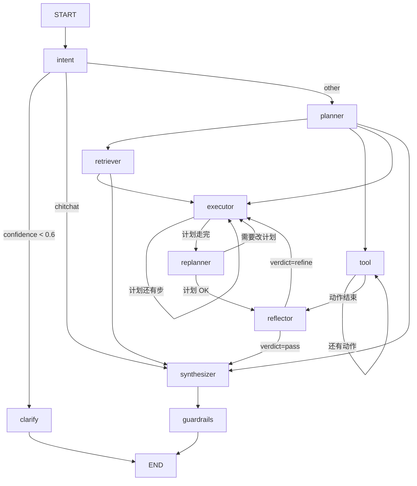

# Research Copilot 技术文档

> 面向科研语料的多智能体研究助手。一条链路：**PDF → bge-m3 双向量 → Milvus 混合检索 + RRF → CRAG 降级 → LangGraph 三范式编排 → 带句级溯源的流式回答**。
>
> 本文档描述截至 `0.1.0` 的实际实现，所有结论都对应仓库里的真实文件与真实命令输出。

---

## 1. 系统概览

### 1.1 技术栈

| 层 | 选型 | 落地位置 |
|:---|:---|:---|
| 前端 | Vue 3 + Nuxt 3 + TypeScript + Pinia + ECharts + PDF.js + Phosphor Icons（**无 UI 组件库**，见 §9.7） | `frontend/` |
| 后端 | Python 3.12+ + FastAPI + SQLAlchemy 2.0（async）+ Alembic | `backend/app/` |
| Agent 编排 | LangGraph（StateGraph + Checkpointer + 条件边 + 循环） | `backend/app/agents/` |
| 模型接入 | OpenAI Python SDK（`AsyncOpenAI` + 自定义 `base_url`，支持流式） | `backend/app/llm/` |
| 向量检索 | Milvus 2.4 standalone（Dense + Sparse 双向量） | `backend/app/db/milvus.py` |
| 结构化存储 | PostgreSQL 16 | `backend/app/models/` |
| 后台任务 | **进程内** `asyncio.to_thread`（不依赖 Redis / Celery / 独立 worker 容器） | `backend/app/indexing/runner.py` |
| Embedding | BAAI/bge-m3（Dense dim=1024 + Sparse，ModelScope 加载） | `backend/app/embeddings/` |
| 文档解析 | MinerU 为主，失败降级 PyMuPDF → pdfplumber → pypdf | `backend/app/parsers/` |
| 图论 | NetworkX | `backend/app/graph_analysis/` |
| 工具协议 | 全部封装为 MCP Server（FastMCP），Agent 侧用 `MultiServerMCPClient` | `backend/app/mcp_servers/`、`backend/app/agents/mcp/` |
| 部署 | Docker Compose（6 个服务） | `docker-compose.yml` |

### 1.2 代码规模

| 项 | 数量 |
|:---|:---|
| 后端 Python 文件 | 85 个（`backend/app/**/*.py`） |
| 后端代码行数 | 8,419 行 |
| 前端 `.vue` / `.ts` 文件 | 29 个（13 业务组件 + 3 基础组件 + 5 页面 + 3 composable + 3 store + 2 类型声明） |
| LangGraph 节点 | 10 个（含 `clarify`） |
| 独立 MCP Server | 5 个 |
| API 端点 | 28 个 |
| 单测 | 183 个，全部通过 |

---

## 2. 目录结构

```
research-copilot/
├── docker-compose.yml            # 6 个服务：postgres/etcd/minio/milvus/backend/frontend
├── .env.example                  # 69 个可调项，含注释
├── Makefile                      # init / up / down / logs / migrate / test / lint ...
├── backend/
│   ├── app/
│   │   ├── main.py               # FastAPI 应用 + lifespan + /health
│   │   ├── core/                 # config / logging / errors / security / compat
│   │   ├── api/v1/               # papers / qa / graph / writing / tools / chat / tasks
│   │   ├── models/               # 7 张表的 SQLAlchemy 模型
│   │   ├── schemas/              # Pydantic v2 请求/响应模型
│   │   ├── agents/
│   │   │   ├── graph.py          # ★ 图定义与条件边
│   │   │   ├── state.py          # ★ AgentState（TypedDict）
│   │   │   ├── checkpointer.py   # Postgres checkpointer
│   │   │   ├── nodes/            # ★ 10 个节点
│   │   │   ├── prompts/          # ★ 9 个 Markdown Prompt
│   │   │   └── mcp/              # 工具装载（MultiServerMCPClient + 本地工具）
│   │   ├── mcp_servers/          # ★ 5 个独立 FastMCP Server
│   │   ├── rag/                  # ★ fusion / retriever / reranker / crag / query_rewrite / source_tracing
│   │   ├── llm/                  # client / structured / streaming
│   │   ├── embeddings/           # bge-m3 双向量
│   │   ├── parsers/              # MinerU 适配 + 降级链 + 分块
│   │   ├── graph_analysis/       # NetworkX 引文图
│   │   ├── indexing/             # 进程内后台任务（pipeline / runner），替代原 workers/
│   │   └── db/                   # session / milvus
│   ├── alembic/                  # 迁移
│   └── tests/                    # 12 个测试文件 / 183 个用例
├── frontend/
│   ├── pages/                    # index(对话) / papers / graph / writing / tools
│   ├── components/               # 13 个业务组件 + ui/ 下 3 个基础组件
│   ├── composables/              # useApi / useChatStream / useMarkdown
│   ├── stores/                   # chat / papers / ui
│   ├── assets/css/               # tokens.css（Linear token）+ main.css（共享类）
│   └── types/                    # api.ts + phosphor-icons.d.ts
└── docs/
    ├── 技术文档.md                # 本文
    └── reference-projects.md      # 同类开源项目实测调研（在仓库根的 docs/）
```

---

## 3. 部署与运行

### 3.1 服务拓扑

| 服务 | 镜像 | 端口 | 健康检查 |
|:---|:---|:---|:---|
| postgres | `postgres:16-alpine` | 5432 | `pg_isready` |
| etcd | `quay.io/coreos/etcd:v3.5.16` | — | Milvus 元数据 |
| minio | `minio/minio` | — | Milvus 对象存储 |
| milvus | `milvusdb/milvus:v2.4.15` | 19530 / 9091 | `curl /healthz` |
| backend | `./backend` | 8000 | `curl /health` |
| frontend | `./frontend` | 3000 | `curl /` |

**没有 redis，也没有独立 worker。** 文档解析与向量入库都在 backend 进程内跑（见 §3.4），
所以服务数从 8 降到 6，少一个要维护的中间件、少一份要同步的配置。

Milvus standalone 单机建议预留 **≥4GB 内存**。

### 3.2 启动

```bash
cp .env.example .env      # 或 make init
make up                   # docker compose up -d --build
```

首次启动会把 bge-m3（约 2GB）拉到 `models_cache` 卷；全部服务 `healthy` 约需 2–5 分钟（Milvus 最慢）。

### 3.3 本机开发（不依赖 docker）

```bash
cd backend && pytest                    # 183 个离线用例
python run.py --no-reload               # 本机起后端（会打印已切到 SelectorEventLoop）
```

**Windows 上必须用 `python run.py`，不要直接 `uvicorn app.main:app`。**
原因见 §9.1。

### 3.4 长任务：为什么去掉了 Redis / Celery

解析 + 嵌入 + 入库是长任务，原来走 Celery + Redis。现在改成**进程内后台线程**：

| 关注点 | 旧（Celery + Redis） | 新（`app/indexing/runner.py`） |
|:---|:---|:---|
| 调度 | Celery worker 拉 `redis://` 队列 | `asyncio.to_thread` 提交到事件循环的线程池 |
| 组件 | +redis 服务 +worker 容器 +broker 配置 | 0 个新组件 |
| 进度 | Celery result backend | 写 `tasks` 表，前端轮询 `/api/v1/tasks/{id}` |
| 强引用 | — | `_PENDING: set[asyncio.Task]`（asyncio 只持弱引用，不持引用会被 GC 掉） |
| 崩溃语义 | 任务留在队列，worker 重启可续 | **进程重启 = 任务丢失，`tasks` 表留下 `running`** |

代价写在明处：单机 / 单副本部署够用；真要可靠队列时把 `_spawn` 换成 arq / rq 即可，
`app/indexing/pipeline.py` 一行都不用动 —— 流水线本身不知道自己被谁调度。

`/health` 的组件列表也相应从 `postgres / redis / milvus / llm` 变成
`postgres / milvus / mineru / llm`。

### 3.5 文档解析：MinerU 为主，三级降级兜底

`app/parsers/pdf.py` 里的 `_BACKENDS` 是一个**有序降级链**，逐个 try：

```
mineru  →  pymupdf  →  pdfplumber  →  pypdf
```

- **MinerU**（`app/parsers/mineru.py`）负责版面还原、OCR、公式、表格。走 CLI
  （`mineru -p <pdf> -o <out>`，参数由 `MINERU_METHOD` / `MINERU_DEVICE` / `MINERU_EXTRA_ARGS` 拼），
  解析完读回 `*content_list.json`，按 `page_idx` 归页折成统一的 `PdfPage`。
  表格 HTML 压成纯文本，图只保留图注 —— 下游要的是可检索的文本，不是渲染。
- **降级**：MinerU 不在 PATH、超时（`MINERU_TIMEOUT`，默认 600s）或抛异常，就轮到下一个。
  `MINERU_ENABLED=false` 时直接跳过它。
- **可见性**：实际生效的解析器写进 `papers.parser`，**并在 `PaperOut` 里返回**，
  文献库列表直接显示 —— 降级是静默的，用户必须能一眼看出来。

MinerU 建议装在**独立 venv 或独立容器**里（torch + 版面模型权重好几个 GB），
用 `MINERU_CMD` 指过去，不要塞进 API 进程：

```bash
python -m venv C:/tmp/mineru-venv
C:/tmp/mineru-venv/Scripts/python.exe -m pip install torch --index-url https://download.pytorch.org/whl/cpu
C:/tmp/mineru-venv/Scripts/python.exe -m pip install "mineru[core]"
# 然后在 .env 里：MINERU_CMD=C:/tmp/mineru-venv/Scripts/mineru.exe
```

`/health` 里 mineru 项**只查 CLI 在不在**，不真跑解析 —— 一次解析几十秒起步，健康检查等不起。

---

## 4. Agent 架构

### 4.1 图结构

三范式融合在一张有向循环图里，**三处循环都显式建在图上**（不藏进节点内部），便于观测与断言：



三处循环与上限：

| 循环 | 边 | 上限 | 参数 |
|:---|:---|:---|:---|
| 计划内多步 | `executor → executor` | 计划步数 | — |
| Replan | `executor → replanner → executor` | 2 轮 | `REPLAN_MAX_ROUNDS` |
| Refine | `reflector → executor` | 2 轮 | `REFLECTION_MAX_REFINE` |
| CRAG 重写 | `retriever` 内部 | 3 轮 | `CRAG_REWRITE_MAX_RETRY` |
| ReAct | `executor` 单步内 | 4 轮 | `AGENT_MAX_REACT_ROUNDS` |

### 4.2 意图识别（入口）

8 类意图，输出 `{intent, confidence, target_papers, slot_filling}`：

| 意图 | 含义 | 典型路径 |
|:---|:---|:---|
| `single_paper_qa` | 单篇精读 | retriever → executor |
| `cross_paper_reasoning` | 跨文献推理 | retriever → executor（多轮） |
| `literature_search` | 文献检索 | tool（arXiv/PubMed/S2） |
| `graph_analysis` | 图谱分析 | tool（`graph_analyze`） |
| `writing_assist` | 写作辅助 | tool（`write_section`） |
| `visualization` | 可视化 | tool（`make_chart`） |
| `translation` | 翻译 | tool（`translate_text`） |
| `chitchat` | 闲聊 | 直接 synthesizer |

**置信度低于 `INTENT_CONFIDENCE_THRESHOLD`（0.6）→ 走 `clarify` 节点澄清追问，然后结束。**
这条闸门是抗幻觉的第一道：宁可多问一句，也不在意图不明时硬答。

### 4.3 三范式分工

| 范式 | 实现位置 | 说明 |
|:---|:---|:---|
| **ReAct** | `nodes/executor.py` | 节点内嵌 Thought → Action → Observation 循环，`parse_action()` 解析 LLM 输出的 `Action / Action Input`，最多 4 轮 |
| **Plan-and-Execute** | `nodes/planner.py` + `nodes/executor.py` + `nodes/replanner.py` | Planner 出结构化 `list[PlanStep]`，Executor 逐步执行，Replanner 依据 Observation 决定是否改计划（≤2 轮） |
| **Reflection** | `nodes/reflector.py` | 对 Executor 输出打 4 维分，低于阈值触发 refine（≤2 次），轨迹写入 `thoughts` 供可观测 |

模型分层（成本优化）：

| 角色 | 配置项 | 默认 |
|:---|:---|:---|
| Planner / Reviewer（要推理） | `LLM_MODEL_PLANNER` / `LLM_MODEL_REVIEWER` | `deepseek-chat` |
| Executor（量大、要便宜） | `LLM_MODEL_EXECUTOR` | `deepseek-chat` |

### 4.4 Reflection 评分维度

| 维度 | 含义 |
|:---|:---|
| `faithfulness` | 是否只依据检索上下文作答 |
| `relevance` | 是否切题 |
| `coherence` | 结构与连贯性 |
| `completeness` | 是否覆盖问题各部分 |

输出 `{scores, overall, verdict, critique, round}`；`verdict == "refine"` 时才回边到 `executor`。

### 4.5 状态（AgentState）

`backend/app/agents/state.py`，TypedDict，关键字段分四组：

- **输入**：`query` / `session_id` / `user_id` / `history`（`operator.add` 累加）
- **意图**：`intent` / `confidence` / `target_papers` / `slot_filling`
- **计划**：`plan` / `plan_round` / `current_step` / `thoughts`（ReAct 轨迹，`operator.add`）
- **检索**：`retrieved` / `crag_level` / `rewrite_round` / `rewritten_query`
- **反思**：`reflections`（4 维分 + verdict）
- **输出**：`answer` / `citations` / `grounding_ratio` / `unsupported_claims`

### 4.6 Checkpointer

`agents/checkpointer.py` 把图状态落到 PostgreSQL，支撑多轮会话续跑。
`AUTO_CREATE_TABLES=true` 时启动即建表；生产用 `alembic upgrade head`。

---

## 5. 抗幻觉 RAG

### 5.1 检索链路

```
query
  ├─ Dense 召回（bge-m3 dense, dim=1024, COSINE）──┐
  └─ Sparse 召回（bge-m3 sparse, 词权重）──────────┤
                                                   ▼
                              RRF 融合（k=60，基于排名而非原始分）
                                                   ▼
                              CrossEncoder 重排（BAAI/bge-reranker-v2-m3）
                                                   ▼
                                   CRAG 判定 → 生成 / 重写 / 联网兜底
```

**为什么用 RRF 而不是加权分数**：Dense 出的是余弦相似度（0–1），Sparse 出的是内积（无上界），两者不可比。RRF 只用名次，天然免疫量纲问题：

$$\text{score}(d) = \sum_{i} \frac{1}{k + \text{rank}_i(d)},\quad k = 60$$

同一文档被多路召回则分数累加（`app/rag/fusion.py`，13 个单测覆盖去重、并列名次、归一化等边界）。

### 5.2 CRAG 三级降级

`app/rag/crag.py` 给融合后的上下文打粗粒度相关性分，按阈值三分类：

| 判定 | 条件 | 动作 |
|:---|:---|:---|
| `relevant` | `score ≥ CRAG_RELEVANCE_THRESHOLD`（0.5） | 直接生成 |
| `ambiguous` | `CRAG_AMBIGUOUS_LOW ≤ score < 0.5`（0.3） | Query Rewrite 重试，≤3 轮 |
| `irrelevant` | `score < 0.3` | Web Search 兜底；仍无果 → `EmptyRetrievalError`(3002) |

降级路径写在图外、检索层内，因此 `/qa/retrieve` 也能单独观测到 `crag_level`。

### 5.3 溯源引擎

`app/rag/source_tracing.py`，回答里每个 `[n]` 标记都要能落到检索上下文：

1. **引用白名单校验**：只允许引用本次检索上下文里的 chunk，越界标记记为 `bad_citation_ref`
2. **NLI 蕴含验证**：句子 ↔ 被引 chunk 做蕴含判定，写入 `Citation.verified`
3. **Grounding Ratio** = 有据句数 / 总声明句数，低于 `GROUNDING_MIN_RATIO`（0.8）即 `low_grounding`
4. **短衔接句豁免**：「综上所述。」这类无信息量的句子不计入分母，避免有据率被稀释

### 5.4 四层 Guardrails

`app/agents/nodes/guardrails.py`，四个检查函数彼此独立、单独可测：

| 层 | 函数 | 产出标记 |
|:---|:---|:---|
| 输入侧 | `check_input` | `injection_suspected`（提示注入）、`empty_query`、`truncated` |
| 检索侧 | `check_retrieval` | `low_quality_context`、`single_source` |
| 生成侧 | `check_generation` | `bad_citation_ref`、`prompt_leak`、`low_grounding` |
| 输出侧 | `check_output` | `html_escaped`、`output_truncated` |

`decide()` 汇总成四种动作：

| 动作 | 触发条件 |
|:---|:---|
| `strip` | 疑似注入 → 剥离可疑片段后继续 |
| `block` | `prompt_leak` → 直接阻断 |
| `refine` | `low_grounding` 或 `bad_citation_ref` → 打回重写 |
| `pass` | 其余情况放行 |

---

## 6. MCP 工具层

**所有外部能力都走 MCP，业务代码里不出现硬编码 HTTP。** 分两处：

### 6.1 独立 MCP Server（`backend/app/mcp_servers/`）

FastMCP `@mcp.tool()` 定义，可独立进程运行，也可进程内直调（`MCP_TRANSPORT=inproc`）。

| Server | 工具 | 关键参数 |
|:---|:---|:---|
| `arxiv_server.py` | `arxiv_search` | query / max_results |
| `pubmed_server.py` | `pubmed_search` | query / max_results / year_from |
| `semantic_scholar_server.py` | `semantic_scholar_search` | query / max_results（可配 `SEMANTIC_SCHOLAR_API_KEY`） |
| `python_exec_server.py` | `python_exec` | code / timeout（默认 10s，`PYTHON_EXEC_MAX_MEM_MB`=512） |
| `web_search_server.py` | `web_search` | query / max_results / topic（Tavily，可配 `TAVILY_API_KEY`） |

每个 Server 都有 `MCP_*_ENABLED` 开关；关掉后不会拉子进程、不发外网请求 —— 单测默认全关。

### 6.2 本地工具（`agents/mcp/local_tools.py`）

走内部数据、不需要外部 Server：

| 工具 | 作用 |
|:---|:---|
| `retrieve_papers` | 走本地混合检索 |
| `graph_analyze` | 走 NetworkX 引文图 |
| `make_chart` | 生成 ECharts 配置 |
| `write_section` | 按模板生成章节草稿 |
| `translate_text` | 学术翻译，保留术语原文 |

### 6.3 装载与暴露

- **Agent 侧**：`agents/mcp/client.py` 用 `langchain-mcp-adapters` 的 `MultiServerMCPClient` 聚合远端 Server 与本地工具，`registry.py` 统一成工具注册表。
- **反向暴露**：`MCP_EXPOSE_API=true` 时用 `fastapi-mcp` 把后端 API 挂到 `/mcp`。装不上就跳过 —— 这是可选对外能力，不该让服务起不来。

---

## 7. 数据模型

### 7.1 PostgreSQL（7 张表）

| 表 | 作用 | 关键列 |
|:---|:---|:---|
| `papers` | 论文元数据 | `title` `authors` `abstract` `year` `venue` `doi` `arxiv_id` `pmid` `s2_id` `pdf_path` `pdf_sha256` `file_size` `page_count` `parser` `status` `error` `num_chunks` `indexed_at` `tags` `meta` |
| `paper_sections` | 章节树 | `paper_id` `parent_id` `name` `raw_heading` `level` `order_index` `page_start` `page_end` |
| `paper_chunks` | 分块 | `paper_id` `section_id` `chunk_index` `content` `token_count` `char_count` `section_name` `page_start` `page_end` `char_offset` `milvus_id` `embedding_model` |
| `paper_citations` | 引文边（图谱原料） | `citing_paper_id` `cited_paper_id` `cited_title` `cited_authors` `cited_year` `cited_doi` `cited_arxiv_id` `section` `page` `raw_text` `resolved_at` |
| `conversations` | 会话 | `title` `default_intent` `paper_ids` `meta` |
| `messages` | 消息 + 可观测字段 | `conversation_id` `role` `content` `intent` `intent_confidence` `slot_filling` `target_papers` `citations` `grounding_ratio` `unsupported_claims` `reflections` `plan` `tool_calls` `latency_ms` `token_usage` |
| `tasks` | 后台任务（进程内执行） | `kind` `status` `progress` `payload` `result` `error` `attempts` `started_at` `finished_at` |

`messages` 表把意图置信度、引用、有据率、反思、计划、工具调用全部落库 —— 这正是 Demo 里"可解释"的持久化形态。

### 7.2 Milvus 集合（`papers`）

| 字段 | 类型 | 说明 |
|:---|:---|:---|
| `id` | VARCHAR(64) | 主键（= chunk 的稳定 ID） |
| `paper_id` | VARCHAR(64) | 归属论文 |
| `chunk_index` | INT64 | 块序号 |
| `section` | VARCHAR(512) | 章节名 |
| `page_start` / `page_end` | INT64 | 页码，供 PDF.js 定位 |
| `content` | VARCHAR(65535) | 原文 |
| `dense` | FLOAT_VECTOR(1024) | bge-m3 dense |
| `sparse` | SPARSE_FLOAT_VECTOR | bge-m3 sparse |

索引：`HNSW`（`MILVUS_INDEX_TYPE`），度量 `COSINE`（`MILVUS_METRIC_TYPE`）。
混合检索用 `AnnSearchRequest` + `RRFRanker`，与本地 `fusion.py` 的 RRF 保持同一套排序语义。

---

## 8. API 契约

### 8.1 统一响应体

所有接口（含错误）都是：

```json
{ "code": 0, "data": {}, "message": "ok" }
```

| 错误码段 | 含义 |
|:---|:---|
| 1xxx | 通用（1001 不存在 / 1002 参数不合法 / 1003 未认证 / 1004 无权限 / 1005 冲突） |
| 2xxx | 论文与解析（2001 解析失败 / 2002 不支持的类型） |
| 3xxx | 检索与 RAG（3001 检索失败 / 3002 检索不到资料 / 3003 溯源不通过） |
| 4xxx | Agent（4001 执行失败 / 4002 意图不明确需澄清） |
| 5xxx | 工具与 MCP（5001 工具失败 / 5002 MCP 连接失败） |
| 9xxx | 系统（9001 模型失败 / 9002 限流 / 9003 数据库不可用 / 9999 内部错误） |

### 8.2 端点清单（28 个）

| 方法 | 路径 | 说明 |
|:---|:---|:---|
| GET | `/` | 服务信息 |
| GET | `/health` | 健康检查（Postgres / Milvus / MinerU / LLM） |
| POST | `/api/v1/papers/upload` | 上传 PDF 并入库 |
| GET | `/api/v1/papers` | 论文列表（分页） |
| POST | `/api/v1/papers` | 手工登记论文（无 PDF） |
| GET | `/api/v1/papers/{paper_id}` | 论文详情 |
| PATCH | `/api/v1/papers/{paper_id}` | 更新元数据 |
| DELETE | `/api/v1/papers/{paper_id}` | 删除论文 |
| GET | `/api/v1/papers/{paper_id}/chunks` | 分块内容 |
| GET | `/api/v1/papers/{paper_id}/file` | 原始 PDF（供 PDF.js 取流） |
| POST | `/api/v1/papers/{paper_id}/reindex` | 重新解析入库 |
| POST | `/api/v1/qa/ask` | 提问（完整 Agent 链路） |
| POST | `/api/v1/qa/retrieve` | 只检索（调参用） |
| POST | `/api/v1/qa/trace` | 溯源校验（不生成） |
| POST | `/api/v1/chat/stream` | 流式对话（SSE） |
| GET | `/api/v1/chat/conversations` | 会话列表 |
| GET | `/api/v1/chat/conversations/{conv_id}` | 会话详情 |
| DELETE | `/api/v1/chat/conversations/{conv_id}` | 删除会话 |
| GET | `/api/v1/graph` | 引文图 |
| POST | `/api/v1/graph/analyze` | 图谱分析 |
| POST | `/api/v1/graph/rebuild` | 重建引文边 |
| GET | `/api/v1/writing/templates` | 写作模板 |
| POST | `/api/v1/writing/draft` | 生成章节草稿 |
| POST | `/api/v1/writing/translate` | 学术翻译 |
| GET | `/api/v1/tools` | 可用工具清单 |
| POST | `/api/v1/tools/call` | 直接调用工具 |

### 8.3 SSE 事件协议

`/api/v1/chat/stream` 的 `event` 类型（`app/llm/streaming.py` 的 `Event` 枚举）：

| event | data | 时机 |
|:---|:---|:---|
| `intent` | `{intent, confidence, ...}` | 意图识别完成 |
| `clarify` | `{question, ...}` | 置信度不足，反问用户 |
| `plan` | `{steps: [...]}` | 计划生成 |
| `tool` | `{name, status, ...}` | 工具调用开始/结束 |
| `token` | `{text}` | 正文增量 |
| `citation` | `{chunk_id, ...}` | 每确认一条引用推一条 |
| `reflection` | `{round, scores, verdict}` | 反思打分 |
| `replan` | `{...}` | 计划调整 |
| `guardrail` | `{layer, action}` | 四层防护处置 |
| `error` | `{code, message}` | 业务错误 |
| `done` | `{grounding_ratio, usage}` | 结束（带最终有据率与 token 用量） |

前端 `composables/useChatStream.ts` 逐事件消费，`stores/chat.ts` 把 `intent/plan/reflection/guardrail` 汇成 `AgentTrace` 面板的数据源。

---

## 9. 已知坑与设计取舍

### 9.1 Windows 事件循环冲突（必须走 `run.py`）

- `psycopg` 的异步驱动**不接受 Windows 默认的 `ProactorEventLoop`**，会直接抛 `InterfaceError`
- `asyncio.create_subprocess_exec` 反过来**只支持 Proactor**，Selector 下不可用

两个约束互斥。处理方式：

1. `app/core/compat.py::use_selector_event_loop_on_windows()` 把 policy 切到 `SelectorEventLoop`
2. `mcp_servers/python_exec_server.py` 改用 `subprocess.run` + `asyncio.to_thread`，绕开 `create_subprocess_exec`
3. `backend/run.py` 在 uvicorn 建循环**之前**调用 1，并且**必须传 `loop="none"`**

第 3 条里的 `loop="none"` 是本机实测踩出来的，值得单独记：

uvicorn 0.36 起不再用 event loop policy，改用 `loop_factory`，而

```python
uvicorn.loops.asyncio.asyncio_loop_factory(use_subprocess=False)
# → win32 上直接 return asyncio.ProactorEventLoop
```

也就是说 `--no-reload`（即 `use_subprocess=False`）时，uvicorn 会**覆盖**掉 `run.py`
刚设好的 policy，`set_event_loop_policy()` 变成一行无效代码，psycopg 照样报 Proactor。
实测现象：`/health` 的 postgres 项返回 `InterfaceError: Psycopg cannot use the
'ProactorEventLoop'`，即使明明是用 `run.py` 起的 —— 而提示语又写着"请用 run.py 启动"，
自相矛盾。

`loop="none"` 让 uvicorn 的 loop_factory 为 `None`，退回 `asyncio.new_event_loop()`，
那条路才看 policy。`--reload` 模式恰好没暴露这个问题：reload 走 `use_subprocess=True`，
factory 此时返回 `SelectorEventLoop`。

对照实验（同一台机器，只差 `loop=` 一个参数）：

| 启动方式 | postgres 探测结果 |
|:---|:---|
| `python run.py --no-reload`（`loop` 默认 auto） | ❌ `InterfaceError: Psycopg cannot use the 'ProactorEventLoop'` |
| `python run.py --no-reload`（`loop="none"`） | ✅ 真实连接尝试，3s 后 `ConnectionTimeout` |

### 9.2 健康检查必须有时限

`/health` 里 postgres / milvus / mineru / llm 四项并发跑，postgres 与 milvus 各套 8s 上限（`_guard`），
数据库连接本身设 `DB_CONNECT_TIMEOUT=3`。

原因：某些环境（含本机）对未监听端口是 **DROP 而不是 REJECT**，TCP 连接会一直挂着而不是立刻被拒。没有超时保护，`/health` 会永久不返回，compose healthcheck 直接把容器判死。

`localhost` 会解析出 IPv6 + IPv4 两个地址，libpq 逐个试 → 最坏耗时翻倍，所以默认给 3s（双栈最坏 6s，仍在 8s 护栏内）。

mineru 与 llm 两项**刻意不发网络/进程探测**：mineru 只查 CLI 是否在 PATH（解析一次几十秒，
健康检查等不起）；llm 只查 `LLM_API_KEY` 是否配置（不该按 token 计费）。

### 9.3 数据库异常单独兜

`core/errors.py` 里针对 `SQLAlchemyError` 注册了独立处理器返回 503 信封（`code=9003`）。

不能只靠通用的 `Exception` 处理器：Starlette 会把未注册的异常交给 `ServerErrorMiddleware`，那边**发完响应后仍会 re-raise**，在 `TestClient(raise_server_exceptions=True)` 下直接冒泡成测试失败，前端也会拿到裸 500 而不是统一信封。

### 9.4 模型加载刻意延后

启动时不预热 bge-m3 / CrossEncoder。模型加载要几十秒，放在首个请求里（lazy）比让容器卡在 `starting` 状态更好调。

### 9.5 `RETRIEVAL_MIN_SCORE` 默认关闭

RRF 分值与余弦相似度不同量纲，写死一个阈值等于按错误的分布做过滤。默认 `0.0`（关闭），需按实测分布标定后再打开。

### 9.6 图谱分析只开放 4 种

`AnalysisKind` 类型里有 6 个值，但后端只实现了 `overview` / `pagerank` / `communities` / `paths` 四个分支；`centrality` 与 `timeline` 会静默落到 overview。前端因此只暴露这四个 —— 放出来只会让用户以为有功能其实没有。

### 9.7 前端：为什么把 Element Plus 拿掉了

原先全站用 Element Plus。换掉之后，视觉层由三层构成：

| 层 | 文件 | 承担什么 |
|:---|:---|:---|
| 设计 token | `assets/css/tokens.css` | 表面阶梯、hairline、文字阶、唯一强调色、圆角/间距 scale。暗色是本源的，浅色是推导的 |
| 共享类 | `assets/css/main.css` | `.rc-btn` `.rc-input` `.rc-table` `.rc-pill` `.rc-modal` … |
| 基础组件 | `components/ui/` | 只有 `Modal` / `Drawer` / `Tabs` 三个 |

判断依据是**用不用得上生命周期和结构**：

- 按钮 / 输入框 / 下拉 / 表格在 13 个业务组件里出现上百次。做成 Vue 组件会带来一堆只在两三个
  地方用到的 props（`size` / `loading` / `block` / `danger` / `bare` …），而写成 CSS 类只需
  `class="rc-btn rc-btn--primary"`，一次定义、处处一致。
- `Modal` / `Drawer` 要管 Teleport、Esc、锁 body 滚动、过渡；`Tabs` 要管 `aria-pressed` 与
  v-model。这些是真状态，才值得做成组件。
- 表格用原生 `<table>`：六列固定、无虚拟滚动、无列拖拽、无行选择，只为这些引一个表格库
  等于白交一份运行时开销。

结果：`package.json` 的 dependencies 里没有 UI 框架，客户端产物 `_nuxt` 的 CSS 只有 **23 KB**。

**坑 1：`@phosphor-icons/vue` 只导出 `Ph*` 前缀名，且上游没发 `.d.ts`**

```ts
import { Moon } from '@phosphor-icons/vue'      // ❌ undefined —— 运行时图标直接消失
import { PhMoon } from '@phosphor-icons/vue'    // ✅
```

`dist/index.mjs` 只有一个 export 块，全部是 `PhXxx`；默认导出是个大对象。
另外 `package.json` 的 `types` 指向 `dist/index.d.ts`，但发包时那个文件没进 tarball
（`dist/` 下只有 `.mjs`），所以 TS 报 `TS7016: Could not find a declaration file`。
本地补了 `types/phosphor-icons.d.ts`，**新增图标要在那里补一行** —— 换来 `:size` / `weight`
这些 props 仍受类型约束，而不是整个模块退化成 `any`。

**坑 2：模板里的 `as` 类型断言，vue-tsc 解析不了**

`v-for="(r, i) in (result!.result as Foo[])"` 会报一串 `TS1005 ',' expected`。
正确做法是把收窄写进 `computed`，模板里只用标识符（见 `GraphInsights.vue` 里的
`pagerankRows` / `communityRows` / `pathPayload`）。

**坑 3：`nuxi build` 不做类型检查**

构建走 esbuild/Vite 转换，类型错误不会让构建失败。必须单独跑 `nuxi typecheck`（vue-tsc）。
另外 `tsconfig` 要有 `@types/node`，否则报 `TS2688: Cannot find type definition file for 'node'`。

**坑 4：ECharts 的颜色要跟着主题走**

`CitationGraph.client.vue` 里不写死十六进制，用 `getComputedStyle(document.documentElement)`
现读 `--rc-*`，并在 `ui.theme` 变化时 `setOption(..., { notMerge: true })` 重建。
不这么做的话，切到浅色主题后图上会浮着一张暗色配色的图。

---

## 10. 测试

### 10.1 策略

单测**不依赖任何外部服务**：`tests/conftest.py` 在任何 `app.*` 导入之前把环境变量指向没人监听的端口，并关掉全部 MCP Server。因此 `pytest` 可以在离线的机器上跑完。

需要真库真模型的用例显式标 `@pytest.mark.integration`（默认不跑）。

### 10.2 覆盖

| 测试文件 | 覆盖内容 |
|:---|:---|
| `test_fusion.py` | RRF：去重、累加、k 值、归一化、并列名次 |
| `test_source_tracing.py` | 引用白名单、蕴含校验、有据率、短句豁免 |
| `test_graph_routing.py` | 全部 `route_after_*` 分支 + `parse_action` 解析 |
| `test_crag.py` | 三分类阈值边界、降级路径 |
| `test_chunker.py` | 分块、重叠、token 估算 |
| `test_retriever_context.py` | 融合顺序 → 上下文编号一致性 |
| `test_streaming.py` | SSE 编码与事件枚举 |
| `test_contract.py` | Pydantic 契约（响应体、分页、错误信封） |
| `test_mcp_registry.py` | 工具注册表 |
| `test_mineru_parser.py` | MinerU 适配：argv 拼装、`content_list.json` 定位与归页、表格压平、CLI 缺失处理 |
| `test_indexing_runner.py` | 进程内任务状态机：成功/失败落库、`_PENDING` 自清空、强引用 |
| `test_api_smoke.py` | 路由注册、`/docs`、`/health` 降级、统一信封 |

```bash
cd backend && pytest        # 183 passed
```

### 10.3 前端校验

```bash
cd frontend
npx nuxi typecheck          # vue-tsc，零错误
npx nuxi build              # exit 0，.output 9.71 MB（gzip 3.31 MB）
node .output/server/index.mjs                     # 起构建产物
curl -s --noproxy '*' -o /dev/null -w '%{http_code}' http://127.0.0.1:3010/papers   # 200
```

---

## 11. 验收自检结果

| # | 验收标准 | 结果 | 依据 |
|:---|:---|:---|:---|
| 1 | `docker compose up` 全部服务启动 | ⚠️ 部分验证 | `docker compose config --quiet` exit 0；`config --services` 输出 6 个（postgres/etcd/minio/milvus/backend/frontend，**无 redis / worker**）。**本机 Docker 守护进程未运行**，无法实测 `up` |
| 2 | `/docs` 能打开 Swagger | ✅ | 实测 HTTP 200 |
| 3 | 前端能打开且新 UI 生效 | ✅ | `nuxi build` 产物起服务后 5 个路由全 200：`/` 31,728B · `/papers` 30,646B · `/writing` 25,614B · `/tools` 26,711B · `/graph` 18,108B；SSR HTML 内出现 `rc-btn`×126、`rc-panel`×38、`rc-seg`×21、`rc-dot`×40，无未解析的 `<Ph*>` 标签 |
| 4 | 健康检查有反馈 | ✅ | `/health` 返回 `{code:0, status:"degraded", components:[postgres, milvus, mineru, llm]}`，每项都带 `ok` / `latency_ms` / `detail`。postgres 与 milvus 如实报连不上，mineru 报"找不到可执行文件，将降级解析"，llm `ok=true` |
| 5 | `.env.example` 完整 | ✅ | 69 个键，覆盖 PG / Milvus / MinIO / 检索 / CRAG / LLM / Embedding / MCP / 上传 / **MinerU** |
| 6 | 后端单测全绿 | ✅ | `183 passed in 13.51s`（原 163 + MinerU 14 + 进程内任务 6） |
| 7 | 前端类型检查 + 构建 | ✅ | `nuxi typecheck` exit 0（零错误）；`nuxi build` exit 0，产物 9.71 MB / gzip 3.31 MB |
| 8 | 静态检查干净 | ✅ | `ruff check .` → All checks passed；`ruff format --check .` → 111 files already formatted |
| 9 | 移除 Redis / Celery 不破坏既有功能 | ✅ | `app/workers/` 已删（备份在仓库外）、`celery_id` 列已删、compose 无 redis/worker；183 个用例全绿，其中 163 个是改动前就存在的 |
| 10 | 文档解析走 MinerU | ⚠️ 代码与单测完成，真实 CLI 未跑 | `app/parsers/mineru.py` + 降级链 + `/health` 探测 + 14 个单测全绿；**本机 `mineru` 尚未装完**（torch + 模型权重数 GB，安装脚本见 §3.5），`/health` 里 mineru 项如实报 `找不到 mineru 可执行文件` |

第 1 条的补充说明：`docker compose config` 只校验语法与变量插值，不能证明容器能起来（镜像拉取、healthcheck 时序、卷挂载都得实跑）。在有 Docker 守护进程的机器上按 §3.2 执行即可完成实测。

第 10 条的补充说明：降级链是"活着"的 —— MinerU 缺席时系统照常工作（自动退到 PyMuPDF），
`papers.parser` 会如实记下实际用了哪个。装好 MinerU 后把 `MINERU_CMD` 指过去即可，
不需要改代码；`/health` 的 mineru 项会从 `ok=false` 变成 `ok=true`。

---

## 12. 参数速查

| 参数 | 默认 | 含义 |
|:---|:---|:---|
| `INTENT_CONFIDENCE_THRESHOLD` | 0.6 | 意图置信度下限，低于则澄清 |
| `REPLAN_MAX_ROUNDS` | 2 | 计划调整上限 |
| `REFLECTION_MAX_REFINE` | 2 | 反思打回重写上限 |
| `AGENT_MAX_REACT_ROUNDS` | 4 | 单步内 ReAct 循环上限 |
| `RRF_K` | 60 | RRF 融合常数 |
| `RETRIEVAL_RECALL_K` | 50 | 每路召回候选数 |
| `RETRIEVAL_TOP_K` | 20 | 重排后进入上下文的块数 |
| `CRAG_RELEVANCE_THRESHOLD` | 0.5 | relevant 下限 |
| `CRAG_AMBIGUOUS_LOW` | 0.3 | ambiguous 下限 |
| `CRAG_REWRITE_MAX_RETRY` | 3 | Query Rewrite 上限 |
| `GROUNDING_MIN_RATIO` | 0.8 | 有据率及格线 |
| `CONTEXT_MAX_CHARS` | 12000 | 喂给 LLM 的上下文上限 |
| `MILVUS_DENSE_DIM` | 1024 | bge-m3 dense 维度 |
| `DB_CONNECT_TIMEOUT` | 3 | 数据库连接超时（秒） |
| `PYTHON_EXEC_TIMEOUT` | 10 | Python 沙箱执行上限（秒） |
| `MINERU_ENABLED` | true | 关掉则完全跳过 MinerU，直接用 PyMuPDF |
| `MINERU_CMD` | `mineru` | MinerU CLI；可写绝对路径指向独立 venv 的 `mineru.exe` |
| `MINERU_METHOD` | `auto` | `auto` / `txt` / `ocr`（对应 CLI 的 `-m`） |
| `MINERU_DEVICE` | `cpu` | `cpu` / `cuda`（对应 CLI 的 `-d`） |
| `MINERU_TIMEOUT` | 600 | 整篇解析上限（秒）；CPU 上每页数秒起，别设太小 |
| `MINERU_EXTRA_ARGS` | 空 | 追加 CLI 参数（`-f` / `-t` / `-l`），补版本差异项 |
