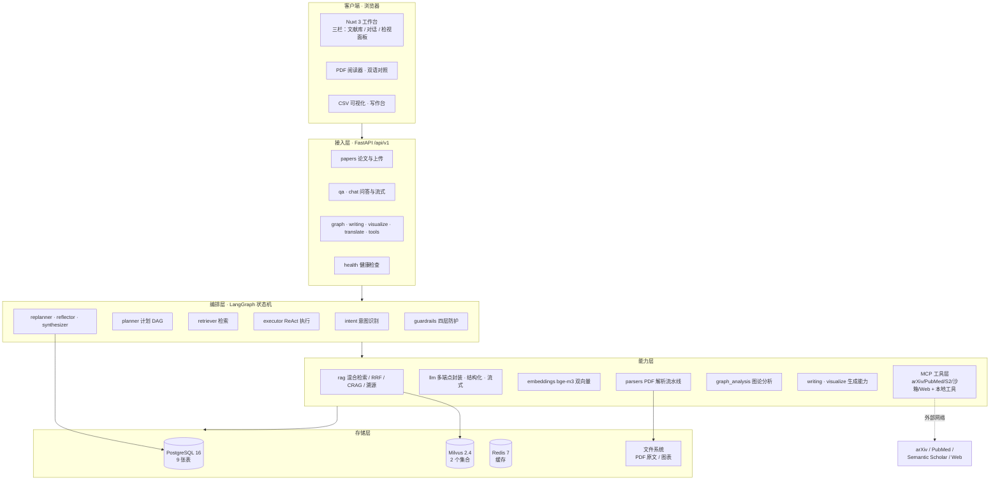
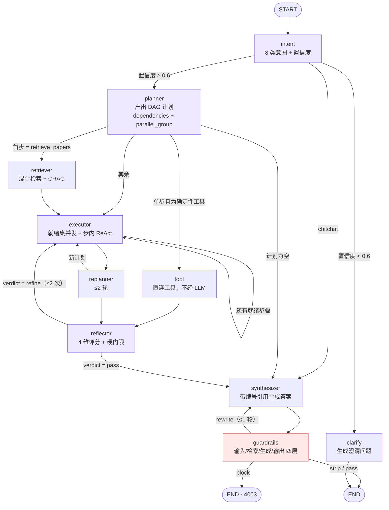
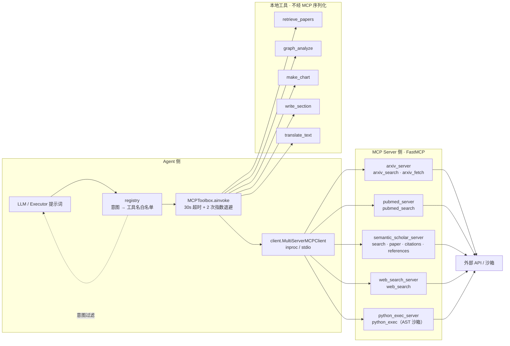
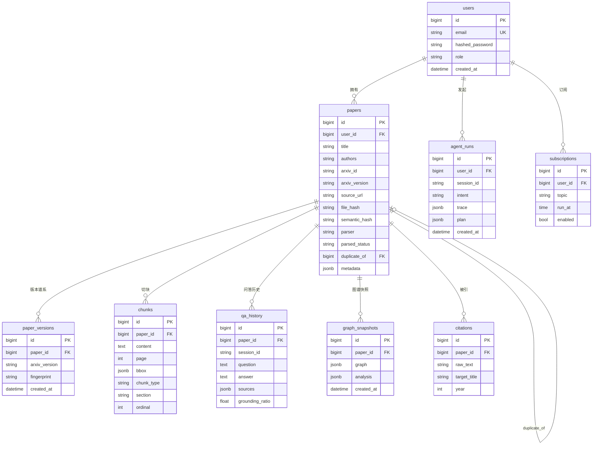
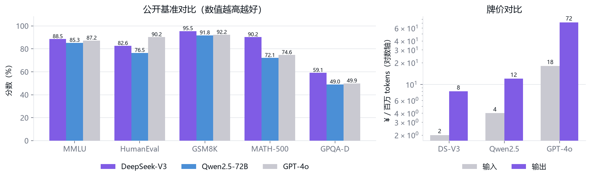
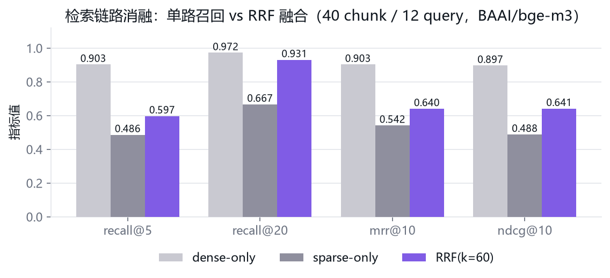
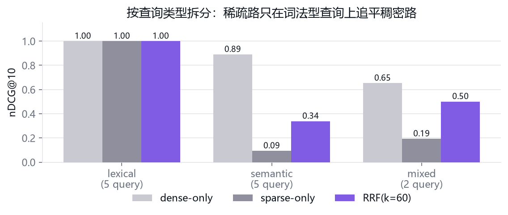
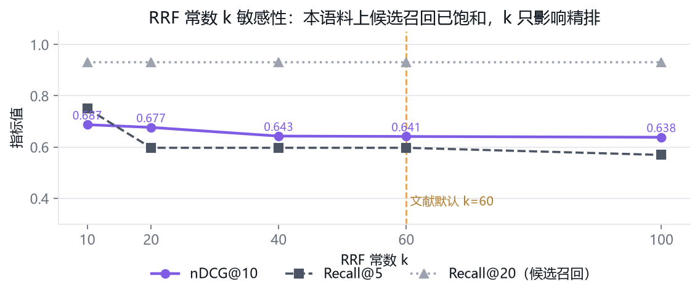
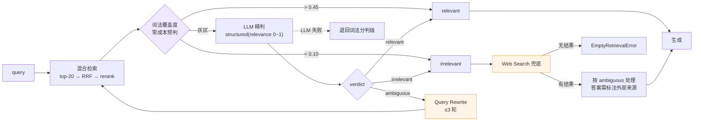

# Research Copilot 技术文档

> 桌面端 Multi-Agent 学术研究系统 · v0.1.0 · 2026-10-04

| 项目 | 内容 |
|:---|:---|
| 系统代号 | Research Copilot（工作区内目录名 `research-copilot`） |
| 定位 | 面向单机科研场景的「论文入库 → 检索问答 → 图谱分析 → 写作辅助」一体机 |
| 核心链路 | PDF → bge-m3 双向量 → Milvus 混合检索 + RRF → LangGraph 三范式编排 → 带句级溯源的流式回答 |
| 规模 | 后端 114 个模块 / 19,769 行；前端 35 个组件 / 12,400 行；离线测试 9,422 行 |
| 交付版本 | `research-copilot @ 5c97bf0`（27 次提交） |

---

## 阅读指引

| 你是谁 | 先读 |
|:---|:---|
| 只想把系统跑起来 | 仓库根目录 `README.md` |
| 想理解系统怎么搭起来的 | 第 3 章 → 第 4 章 |
| 只关心 AI 部分的技术选型与依据 | 直接读第 4 章（本文档的重点章节） |
| 要接手改代码 | 第 3.5 节「关键架构决策」+ 第 6 章 + 仓库内 `memory/PITFALLS.md` |

本文档中所有实验数据均来自**本机实跑**，脚本与原始结果随代码一起提交
（`backend/benchmarks/`、`docs/figures/retrieval_ablation.json`），可复现。

---

# 1. 项目概述

## 1.1 一句话定位

Research Copilot 是一个**单机可运行**的多智能体学术研究助手：把本地 PDF 论文变成可检索、
可溯源、可推理的知识库，并在同一工作台里完成问答、跨篇综述、引文图谱分析、图表生成与
中英互译。

它不是一个「PDF + 大模型」的问答壳子。系统的每一个输出都必须能指回原文的**具体页码与
坐标框**，每一次引用都必须通过**白名单 + 蕴含验证**，模型编造出来的引用会被机械地拦下来。

## 1.2 要解决的问题

| 科研场景中的真实痛点 | 现有做法的缺口 | 本系统的应对 |
|:---|:---|:---|
| 读一篇论文要反复回翻原文，摘不到段落 | 通用问答模型回答流畅但无处核对 | 句级溯源：答案片段 ↔ chunk ↔ 页码 ↔ bbox 高亮 |
| 综述几十篇论文时上下文放不下 | 直接塞长上下文 ⇒ 中间信息丢失、成本爆炸 | 混合检索 + 重排后只喂 5 个 chunk，附编号白名单 |
| 模型会「发明」参考文献 | 提示词里写「不要编造」基本无效 | 引文条目字段一律取自 `papers` 表；`/writing/references` 全流程零模型调用 |
| 单轮问答无法处理「先查再算再比」的任务 | 单纯 ReAct 容易跑偏、无全局计划 | Plan-and-Execute（DAG 计划）+ ReAct（步内）+ Reflection（自省）三范式融合 |
| 外部工具（arXiv / PubMed / 沙箱）散落在代码里 | 硬编码 HTTP、难替换、难审计 | 全部工具统一为 MCP Server，Agent 侧只认工具名 |
| 长任务需要额外的消息队列 | 单机部署里引入 Celery + Redis broker 属过度设计 | 进程内 `asyncio.to_thread` + `papers.parsed_status` 状态位 |

## 1.3 技术栈总览

| 层次 | 选型 | 版本 | 一句话理由 |
|:---|:---|:---|:---|
| 前端框架 | Nuxt 3 + Vue 3 + TypeScript | 3.x / 3.4 | SSR 首屏 + 客户端 PDF.js 渲染，一套代码两用 |
| 样式 | Tailwind v4（`@tailwindcss/vite`） | 4.x | 无 `tailwind.config.js`，令牌集中在 `@theme` |
| 图表 | ECharts | 5.x | 力导向图 + 时间轴 + SVG 导出，一个库全覆盖 |
| PDF 渲染 | PDF.js | 4.x | 与后端 bbox 归一化坐标直接对齐 |
| 数学公式 | MathJax | 3.x | 行内 `$…$` 与块级公式混排 |
| 后端框架 | FastAPI | 0.115 | 原生 async + OpenAPI 自动生成（顺带暴露为 MCP） |
| Agent 编排 | LangChain + LangGraph | 0.3 / 0.2 | 图即状态机，循环与分支显式可断言 |
| ORM / 迁移 | SQLAlchemy 2.0 + Alembic | 2.0 | 手写迁移，允许 `CHECK` / 自引用 FK 等表达 |
| 关系库 | PostgreSQL | 16 | JSONB 存溯源结构，唯一约束做内容去重 |
| 向量库 | Milvus | 2.4 | 同一集合内支持 Dense + Sparse 双向量与倒排索引 |
| 缓存 | Redis | 7 | 三库之一，但**不**做任务队列 |
| Embedding | ModelScope `BAAI/bge-m3` | — | 一个模型同时给 Dense(1024) + Learned Sparse |
| 重排 | `BAAI/bge-reranker-v2-m3` | — | CrossEncoder 精排，与 bge-m3 同源同分词器 |
| 主解析器 | MinerU（CLI，独立 venv） | — | 版面 / 公式 / 表格还原；不可用时降级 PyMuPDF |
| 工具协议 | MCP（FastMCP 定义 + `fastapi-mcp` 暴露） | — | 工具与 Agent 解耦，跨进程可验证 |

## 1.4 交付状态

| 阶段 | 内容 | commit | 累计测试 |
|:---:|:---|:---|:---:|
| 1 | 数据持久层：PostgreSQL 9 表 + Milvus 2 集合 | `d63ac70` | — |
| 2 | Agent 图：LangGraph 10 节点 + HITL 中断 + e2e | `f5a1397` | — |
| 3 | 核心节点：DAG 计划 + 就绪集并发 + 硬门限评审 | `ce5c436` | 281 |
| 4 | 检索链路 + 溯源引擎三方法融合 | `04d2ce4` | 333 |
| 5 | MCP 工具链：AST 沙箱守卫 + 超时重试 + 意图过滤 | `deffd57` | 395 |
| 6 | Guardrails 四层防护 + 决策路由 | `e6a9bb2` | 438 |
| 7 | PDF 上传 / 解析流水线 / 语义级去重 | `a8b53af` | 489 |
| 8 | RAG 问答 API：SSE 规格事件 + 跨篇时间轴 + bbox 定位 | `2517b2e` | 531 |
| 9 | 工具自主调用 + 定时任务（主题探索闭环） | `cbc1aa1` | 551 |
| 10 | 引文图谱构建 / 图论分析 / 领域综述 | `b4338e7` | 573 |
| 11 | 学术写作 Copilot（框架 / 无幻觉 References / 4 类图表） | `01b0a8f` | 588 |
| 12 | CSV 可视化 + 学术翻译 | `1a7136a` | 612 |
| 13 | PDF 阅读器 + 双语段落级联动 | `cab786f` | 614 |
| — | 引用图谱可视化重做（力导向 + 社区图例 + 导出） | `5c97bf0` | 614 |

**当前测试基线**：`pytest -m 'not model'` = **614 passed / 2 skipped / 10 deselected**。

## 1.5 术语表

| 术语 | 含义 |
|:---|:---|
| chunk | 解析流水线切出的最小检索单元，带 `page` / `bbox` / `chunk_type` |
| Block | PDF 解析的**唯一**中间表示（`text/page/bbox/kind/level`），所有解析器共用 |
| RRF | Reciprocal Rank Fusion，基于名次的多路召回融合 |
| CRAG | Corrective RAG，按检索质量判级并触发改写 / Web 兜底 |
| grounding_ratio | 答案实词中被证据支持的比例，抗幻觉的核心闸门 |
| attribution_method | 引用归属判定用的方法：`nli` / `hybrid` / `self_citation` |
| HITL | Human-in-the-loop，在 executor 前 `interrupt` 让人改计划 |
| 降级 N 项 | 前端顶栏状态：后端可达但依赖（PG/Milvus/MinerU/LLM）有缺失 |

---

# 2. 需求分析

## 2.1 用户画像与典型场景

目标用户是**单机作业的研究生 / 科研人员**：手头有几十到几百篇 PDF，机器是普通笔记本或
单卡工作站，不愿意（也不适合）把未发表的稿件上传到第三方服务。

| # | 用户故事 | 触发意图 | 关键约束 |
|:---:|:---|:---|:---|
| U1 | 我把一篇论文传进来，想问「它的方法在什么数据集上验证过」 | `single_paper_qa` | 答案必须给页码，能一键跳到原文高亮 |
| U2 | 我想知道这三篇论文对同一问题的处理方式差异 | `cross_paper_reasoning` | 需要跨篇时间轴 + 每篇各自的引用来源 |
| U3 | 帮我找近两年关于「长文本检索」的论文并直接下载入库 | `literature_search` | 走 arXiv / Semantic Scholar，命中不足要自动换词重试 |
| U4 | 我这些论文的引文网络长什么样，哪些是枢纽节点 | `graph_analysis` | 力导向图 + PageRank / 社区 / 中介中心性 |
| U5 | 根据我的想法先出一个论文提纲，引用必须是真实存在的文献 | `writing_assist` | 幻觉引用必须被检出并标灰，编号不能串 |
| U6 | 把这段实验结果画成折线图，图注要符合期刊格式 | `visualization` | 模型不得接触数值，绘图代码固定 |
| U7 | 把这篇论文的摘要译成中文，术语前后一致 | `translation` | 术语表强制生效，公式与引用编号原样保留 |
| U8 | 我就想问个好 | `chitchat` | 不检索、不调工具、直接答 |

## 2.2 功能性需求

| 编号 | 需求 | 验收判据 | 实现位置 |
|:---|:---|:---|:---|
| FR-01 | PDF 批量入库，自动解析版面 / 公式 / 表格 / 图注 | 一次 ≤20 篇，逐条独立成败 | `api/v1/papers.py`、`parsers/`、`indexing/` |
| FR-02 | 重复论文自动识别，同一 arXiv 论文的新版本单独成谱系 | 版本规则优先于相似度规则 | `parsers/semantic_dedup.py` |
| FR-03 | 混合检索（Dense + Sparse）→ RRF → CrossEncoder 重排 | 三级条数可配，最终回 5 条 | `rag/retriever.py` |
| FR-04 | 检索质量不足时自动降级：改写重试 / Web 兜底 | ambiguous ≤3 轮；irrelevant 走 Web | `rag/crag.py` |
| FR-05 | 答案句级溯源，含页码与 bbox | 每条来源 7 个字段，bbox 归一化 | `rag/source_tracing.py` |
| FR-06 | 有据率低于阈值不允许作为可信答案输出 | `grounding_ratio < 0.8` ⇒ 拒答/标低置信 | `rag/source_tracing.py::enforce` |
| FR-07 | 8 类意图识别，低置信度先澄清 | `confidence < 0.6` ⇒ 追问 | `agents/nodes/intent.py` |
| FR-08 | 复杂任务先出 DAG 计划，按就绪集并发执行 | 无依赖步骤真并发（`asyncio.gather`） | `agents/nodes/planner.py` / `executor.py` |
| FR-09 | 计划执行后自省评分，不达标重规划 / 重执行 | 4 维评分，refine ≤2、replan ≤2 | `agents/nodes/reflector.py` |
| FR-10 | 外部工具（检索 / 沙箱 / 网页）统一协议接入 | 全部为 MCP Server，无硬编码 HTTP | `mcp_servers/`、`agents/mcp/` |
| FR-11 | 沙箱执行模型生成的 Python，不许逃逸 | AST 白名单，拒 `__import__`/`eval`/`open` | `mcp_servers/python_exec_server.py` |
| FR-12 | 四层 Guardrails + 决策路由 | block / rewrite / strip / pass 四态 | `agents/nodes/guardrails.py` |
| FR-13 | 引文图谱构建与图论分析 | 4 种分析算法，快照可复现 | `graph_analysis/` |
| FR-14 | 写作辅助：提纲 → 草稿 → 扩写 → 引文校验 → 图表 | 引文校验零模型调用 | `writing/` |
| FR-15 | 流式输出（SSE），前端增量渲染 | 两条协议各自成流，必以 `done`/`error` 收尾 | `api/v1/chat.py`、`api/v1/qa.py` |
| FR-16 | 主题探索闭环：检索 → 打分 → 下载 → 入库 → 推荐 | SSE 轨迹可见，≥5 篇 | `agents/explore.py` |
| FR-17 | 定时订阅：每天固定时刻跑一次主题探索 | 进程内调度，无需 broker | `workers/scheduler.py` |
| FR-18 | 学术翻译，术语表 + 双向滚动同步 | 段落 ID 由后端定死（`p1/p2`） | `api/v1/translate.py` |

## 2.3 非功能性需求

| 维度 | 指标 | 当前状态 |
|:---|:---|:---|
| 部署 | 一条 `docker compose up -d` 拉起全部服务 | 7 个服务，首启拉 bge-m3 ≈2GB |
| 资源 | 单机可跑；Milvus standalone 建议 ≥4GB 内存 | `MINERU_ENABLED=false` 时不需 GPU |
| 冷启动 | 模型加载不在启动路径上 | bge-m3 / CrossEncoder 均 lazy 加载 |
| 探活 | 任一依赖挂掉，`/health` 必须在数秒内给出结论 | 每项探测 8s 上限，超时即报 |
| 可用性 | 单依赖失效不得拖垮主链路 | CRAG 判级失败退词法；MinerU 缺失退 PyMuPDF；Redis 挂不影响问答 |
| 安全 | 密钥只走环境变量；CORS 显式来源；不记录隐私字段 | `.env` 在 `.gitignore`，只提交 `.env.example` |
| 抗注入 | 忽略指令类攻击必须被识别并剥离 | 6 条关键词直匹配 + 7 条语义模板 |
| 可观测 | 结构化日志 + 请求 ID + Agent 轨迹（trace） | 前端「Agent 轨迹」面板逐节点显示 |
| 可测试 | 无网络、无 GPU、无 Docker 也能跑单测 | 614 例全部离线；`-m model` 才加载真权重 |
| 前端一致性 | 渲染层与对齐逻辑有自动检查 | `npm run check:md`（6 项）、`npm run check:sync`（18 项） |

## 2.4 需求 → 实现追溯矩阵

| 需求组 | 主要模块 | 对应测试文件 | 对应章节 |
|:---|:---|:---|:---|
| 入库 / 解析（FR-01/02） | `parsers/`、`indexing/` | `test_parsers_stage7.py`、`test_chunker.py`、`test_mineru_parser.py`、`test_indexing_runner.py` | 5.1 / 5.2 |
| 检索 / 溯源（FR-03~06） | `rag/` | `test_fusion.py`、`test_retriever_chain.py`、`test_crag.py`、`test_source_tracing.py`、`test_retriever_context.py` | 4.3 / 4.4 / 4.7 |
| Agent 编排（FR-07~09） | `agents/` | `test_agent_graph_e2e.py`、`test_core_nodes.py`、`test_graph_routing.py` | 3.2 / 4.5 |
| 工具层（FR-10/11/16/17） | `mcp_servers/`、`agents/mcp/`、`workers/` | `test_mcp_tools.py`、`test_mcp_servers.py`、`test_mcp_registry.py`、`test_explore_api.py` | 3.3 / 4.6 |
| 防护（FR-12） | `agents/nodes/guardrails.py` | `test_guardrails.py` | 4.8 |
| 交付接口（FR-13~15/18） | `api/v1/`、`graph_analysis/`、`writing/`、`visualize/` | `test_api_smoke.py`、`test_qa_stream_api.py`、`test_graph_analysis.py`、`test_writing_stage11.py`、`test_visualize_translate.py` | 第 5 章 |
| 契约与不变量 | 跨模块 | `test_contract.py`、`test_streaming.py`、`test_qa_sources_api.py` | 3.5 / 第 6 章 |

---

# 3. 系统架构

## 3.1 总体架构

系统按「**接入层 → 编排层 → 能力层 → 存储层**」四层组织，层间只通过显式接口通信：
编排层不直接连数据库，能力层不感知 HTTP，接入层不含业务逻辑。



**部署拓扑**（`docker compose`，单机网络 `rc-net`）：

| 服务 | 镜像 | 端口 | 职责 | 健康检查 |
|:---|:---|:---|:---|:---|
| `postgres` | `postgres:16-alpine` | 5432 | 元数据 / 溯源 / 会话 | `pg_isready` |
| `redis` | `redis:7-alpine` | 6379 | 缓存 / 去重标记 / 限流 | `redis-cli ping` |
| `etcd` | `quay.io/coreos/etcd:v3.5.16` | — | Milvus 元数据 | `etcdctl endpoint health` |
| `minio` | `minio/minio` | — | Milvus 对象存储 | `/minio/health/live` |
| `milvus` | `milvusdb/milvus:v2.4.15` | 19530 / 9091 | 向量库 | `/healthz` |
| `backend` | `./backend` | 8000 | FastAPI + Agent + 进程内长任务 | `/health` |
| `frontend` | `./frontend` | 3000 | Nuxt 3 | — |

> 关键取舍：**没有 worker 容器、没有 Celery**。PDF 解析与引文边重建在 backend 进程内用
> `asyncio.to_thread` 跑，进度写 `papers.parsed_status`。代价是进程重启丢任务；换来的是
> 单机部署少三个组件（broker / result backend / worker 镜像）。详见 3.5 ADR-1。

## 3.2 Agent 架构

三种范式不是并列的三个 Agent，而是**同一个有向循环图里的三段职责**：

| 范式 | 承担节点 | 解决什么 |
|:---|:---|:---|
| 意图识别（Intent） | `intent` → `clarify` | 判清用户到底想干什么；不确定就先问 |
| Plan-and-Execute | `planner` → `executor` → `replanner` | 先出全局计划，再按依赖并发执行，失败可重规划 |
| ReAct | `executor` 内部循环 | 单步内 Thought → Action → Observation，最多 4 轮 |
| Reflection | `reflector` | 对产出做 4 维评分，不达标 refine（≤2 次） |
| 输出防护 | `synthesizer` → `guardrails` | 合成答案 → 四层校验 → block/rewrite/strip/pass |



**四处循环全部显式建在图上**，不藏在节点内部 —— 这样才能被观测、被断言、被限流：

| 循环 | 边 | 上限 | 上限用尽后的行为 |
|:---|:---|:---:|:---|
| 计划内多步 | `executor → executor` | 计划长度 | 无就绪步骤 ⇒ `current_step` 推到末尾，交 replanner |
| 重规划 | `executor → replanner → executor` | `REPLAN_MAX_ROUNDS=2` | 交 reflector，不再重规划 |
| 自省重做 | `reflector → executor` | `REFLECTION_MAX_REFINE=2` | 用当前最优结果继续合成 |
| 防护重写 | `guardrails → synthesizer` | 1 轮 | 第二轮直接收尾，不无限重写 |

**路由规则**（条件边集中在 `graph.py`，便于单测）：

| 条件边 | 判据 | 去向 |
|:---|:---|:---|
| `route_after_intent` | `confidence < 0.6` | `clarify` |
| | `intent == chitchat` | `synthesizer` |
| | 其余 | `planner` |
| `route_after_planner_plan` | 计划为空 | `synthesizer` |
| | 首步 `tool == retrieve_papers` | `retriever` |
| | 单步且工具 ∈ `DIRECT_TOOLS` | `tool`（确定性调用，省一次 LLM） |
| | 其余 | `executor` |
| `route_after_execute` | 存在就绪步骤 | `executor` |
| | 无就绪步骤 | `replanner` |
| `route_after_reflect` | `verdict == refine` 且未超限 | `executor` |
| | 其余 | `synthesizer` |
| `route_after_guardrails` | `action == rewrite` 且未重写过 | `synthesizer` |
| | 其余 | `END` |

**计划是 DAG，不是流水线**。`PlanStep` 带两个字段：`dependencies: list[int]`（只允许指向
更早的下标 ⇒ 天然无环）与 `parallel_group: str`。`planner.normalize_dag()` 做拓扑收敛：
下标重排为 `1..n`、依赖映射后越界/前向/自指一律丢弃、同组内互相依赖者退出该组、成员少
于 2 的组直接去掉。执行侧 `ready_indices()` 取「依赖全部 done 的 pending」，
`next_batch()` 在就绪集里取「锚点 + 同组就绪成员」交给 `asyncio.gather` 真并发。
串行计划的行为与改造前完全一致 —— 这是刻意的向后兼容。

## 3.3 MCP 工具集成架构

所有外部能力统一走 **Model Context Protocol**：工具的**定义**在 `app/mcp_servers/`（FastMCP），
工具的**消费**在 `app/agents/mcp/`（`MultiServerMCPClient` 封装），两侧通过工具名与
Pydantic schema 解耦。



**为什么有「本地工具」这一档**：`retrieve_papers` / `graph_analyze` / `make_chart` /
`write_section` / `translate_text` 的实现就在本进程内，封成 MCP Server 只会平白多一次
序列化与一次进程边界。判定标准是「**是否需要跨出本进程**」，而不是「听起来像不像工具」。

**意图 → 工具白名单**（`get_tools_for_intent`）：

| 意图 | 允许的工具 |
|:---|:---|
| `single_paper_qa` | `retrieve_papers` |
| `cross_paper_reasoning` | `retrieve_papers`, `graph_analyze` |
| `literature_search` | `arxiv_search`, `pubmed_search`, `semantic_scholar_search`, `web_search` |
| `graph_analysis` | `graph_analyze`, `retrieve_papers` |
| `writing_assist` | `write_section`, `retrieve_papers` |
| `visualization` | `make_chart`, `python_exec` |
| `translation` | `translate_text` |
| `chitchat` | 空集 |

白名单返回的是**工具名字符串**而非 LangChain Tool 对象 —— executor 是提示词式 ReAct，
它需要的是能写进 prompt 的名字。未登记的意图回退全量（给空集会让整步无工具可用）。

**调用策略**（全部收敛在 `MCPToolbox.ainvoke`）：单次 30s 墙钟超时 + 最多 2 次指数退避
（0.5s → 1s）。只重试「抛异常」；工具「成功返回一条错误说明」（例如沙箱拒绝执行）不算
失败、不重试；**未知工具不重试**（确定性的名字错误，重试只是浪费）。

## 3.4 数据模型

### 3.4.1 关系模型（PostgreSQL 16）

主键一律 `BigInteger + Identity()`，与 Milvus 的 INT64 主键对齐（不用 UUID 字符串，
避免 join 与向量回查时的类型转换）。



| 表 | 关键约束 | 为什么 |
|:---|:---|:---|
| `papers` | `UNIQUE(user_id, file_hash)` | 内容去重；因此**必须先有默认用户**，否则 `user_id NOT NULL` 会让约束形同虚设 |
| `papers` | `ix_papers_arxiv_version` | 版本判定要按 `(arxiv_id, version)` 快查 |
| `papers` | `duplicate_of` 自引用 FK，`ON DELETE SET NULL` | 删主记录时重复记录自动「解锁」 |
| `chunks` | `ck_chunks_chunk_type` 限定 4 值 | 公式 / 图注被摘成独立 chunk，类型必须受控 |
| `qa_history.sources` | JSONB 数组，7 字段 | 溯源契约的持久化形态 |

> 已删除的表：`conversations` / `paper_chunks` / `paper_sections` / `paper_citations` /
> `tasks`。会话改由 `agent_runs.session_id` 聚合，解析进度改用 `papers.parsed_status`，
> 五个冗余表归零。

### 3.4.2 向量模型（Milvus 2.4）

| 集合 | 向量字段 | 索引 | 度量 | 用途 |
|:---|:---|:---|:---|:---|
| `paper_chunks` | `dense_embedding` FLOAT_VECTOR(1024) | HNSW | COSINE | chunk 级稠密召回 |
| | `sparse_embedding` SPARSE_FLOAT_VECTOR | SPARSE_INVERTED_INDEX | IP | chunk 级词法召回 |
| | — | 原生 `RRFRanker`（备用） | — | 两路原生融合 |
| `paper_summaries` | `summary_embedding` FLOAT_VECTOR(1024) | HNSW | COSINE | 论文级语义去重 + 粗筛 |

`paper_chunks` 同时带 `paper_id` / `chunk_id` INT64 标量字段，用于按文献集合过滤
（`build_paper_filter` 生成表达式，检索时下推 —— 不是检索完再筛）。

## 3.5 关键架构决策记录（ADR）

| # | 决策 | 备选方案 | 理由 |
|:---:|:---|:---|:---|
| ADR-1 | 长任务在 backend 进程内跑（`asyncio.to_thread`） | Celery + Redis broker + worker 容器 | 单机部署少三个组件；解析是 CPU 密集的短时任务，不需要分布式调度。代价：进程重启丢任务、无法水平扩展 —— 单机场景可接受 |
| ADR-2 | 显式跑两次单路 ANN 再自己 `rrf_fuse`，不用 Milvus 原生 `hybrid_search` | 原生 `RRFRanker`（公式完全一致） | 原生只回融合后的名次，**不回每条来自哪一路**；而前端溯源面板要显示 dense / sparse / both。多一次 ANN 查询换来源归属，值 |
| ADR-3 | `bbox` 全程归一化到 `[0,1]` | 存 PDF 点坐标 | 前端要按显示尺寸缩放画高亮框；存像素必然随缩放漂移 |
| ADR-4 | 解析中间表示只有一种：`Block` | 每个解析器自定义结构 | 章节判定 / 公式分流 / 图表识别全部只吃 `Block`；多一种结构就多一处转换与一处 bug |
| ADR-5 | 版面分析用 XY-Cut 启发式，不引 LayoutParser | 版面检测模型 | 几百 MB 权重换来的边际收益不值；启发式在本项目的论文语料上够用。升级路径写在 `ponytail:` 注释里 |
| ADR-6 | 沙箱守卫用 AST 而非正则 | 正则黑名单 | 正则匹配源码文本，`__import__("o"+"s")` 一拼就绕过（实测老实现漏）；AST 看结构，拼接也照撞 |
| ADR-7 | 热路径 Guardrails 不调 LLM | 每轮都用模型审一遍 | 每轮多一次模型调用既贵又慢；正则 + 集合运算可覆盖绝大多数攻击。只有「已经决定重写」之后才调一次学术规范分类器 |
| ADR-8 | `/writing/references` 全流程零模型调用 | 让模型补全文献条目 | 作者 / 年份 / 会议字段一律取自 `papers` 表，这是本项目唯一的**结构性**抗幻觉保证点 |
| ADR-9 | `/visualize/generate` 模型只产 `ChartPlan`（画哪种图 + 用哪两列） | 让模型写绘图代码 | 数值全部从 CSV 现取，绘图代码固定。模型碰不到数值，也碰不到解释器 |
| ADR-10 | 前端不引任何 UI 组件库 | shadcn / element-plus / antd | 视觉对齐单一参考站，组件库的默认样式反而是负债；令牌集中在 `@theme` |
| ADR-11 | 溯源里数字由 `numbers_consistent` 单独管，不进 `grounding_ratio` 分母 | 把数字当实词一起算 | 数字改写（`3.2%` → `3.2 percent`）会误伤；分开判更准 |
| ADR-12 | 既有字段名一律沿用，不按规格重命名 | 按规格重命名 | 已有测试与提示词全部依赖现名，重命名零收益且会让全部用例变红（本项目已三次采用这条原则） |

---

# 4. AI 技术方案（重点）

本章回答四个问题：**为什么这样选**、**代价是什么**、**实测结果如何**、**落地时踩了什么**。

## 4.1 大模型选型：DeepSeek-V3 vs Qwen2.5-72B vs GPT-4o

### 4.1.1 选型维度的确定

科研问答场景对模型的需求与通用聊天不同，权重排序如下：

| 维度 | 权重 | 为什么科研场景特别在意 |
|:---|:---:|:---|
| 长文理解与指令遵循 | ★★★★★ | 每次要吞 5 个 chunk 上下文并严格按「只引用 `[n]`」的格式作答 |
| 中文表达能力 | ★★★★☆ | 用户是中文母语者，论文多为英文，需要中英混排 |
| 推理 / 数学 | ★★★★☆ | 「对比三篇论文的评测方法差异」属于多步推理；图注里常有数值 |
| 结构化输出稳定性 | ★★★★☆ | 意图识别 / 计划生成 / 评审打分全走 JSON Mode，格式一乱全链路崩 |
| 单次调用成本 | ★★★★☆ | 一次问答最多 3 次模型调用（意图 + 计划 + 合成），长文档 RAG 输入长 |
| 数据合规 | ★★★★☆ | 未发表稿件不适合出境；国内直连端点更稳 |
| 上下文窗口 | ★★★☆☆ | 检索已经把上下文压到 5 chunk，128K 完全够用 |

### 4.1.2 公开基准对比

数据取自 DeepSeek-V3 技术报告第 8 章（同表对比 GPT-4o / Claude 3.5 Sonnet / Llama 3.1 405B）
与 Qwen2.5-72B 官方模型卡。**同一份表内的数字来自同一评测口径，可横向比较**。

| 模型 | 参数量 | 架构 | MMLU | HumanEval | GSM8K | MATH-500 | GPQA-Diamond | 上下文 |
|:---|:---|:---|:---:|:---:|:---:|:---:|:---:|:---:|
| **DeepSeek-V3** | 671B（激活 37B） | MoE | **88.5** | 82.6 | **95.5** | **90.2** | **59.1** | 128K |
| Qwen2.5-72B | 72B | Dense | 85.3 | 76.5 | 91.8 | 72.1 | 49.0 | 128K |
| GPT-4o | —（未公开） | — | 87.2 | **90.2** | 92.2 | 74.6 | 49.9 | 128K |
| *Claude 3.5 Sonnet（参考）* | — | — | 88.3 | 93.7 | 95.0 | 78.3 | 65.0 | 200K |



**读表结论**：

1. **DeepSeek-V3 在数学与推理类基准上显著领先**：MATH-500 90.2 vs GPT-4o 74.6，
   GPQA-Diamond 59.1 vs GPT-4o 49.9。这两项对应的正是「多篇论文方法对比」「从表格里
   读数值并核算」这类任务。
2. **通用知识（MMLU）三家在统计误差内并驾齐驱**（85.3 ~ 88.5），不构成区分度。
3. **代码能力 GPT-4o 更强**（HumanEval 90.2 vs 82.6）。但在本项目里，代码生成被收敛到
   `python_exec` 沙箱这一个窄接口，且推理型任务由固定绘图代码承担 —— 代码能力不是瓶颈。
4. **MoE 的激活参数只有 37B**，意味着同等吞吐下单位成本更低；这也是价格差的来源。

### 4.1.3 成本对比

| 模型 | 输入（¥/百万 tokens） | 输出（¥/百万 tokens） | 相对成本 | 备注 |
|:---|:---:|:---:|:---:|:---|
| `deepseek-chat`（V3） | 2.0（缓存命中 0.5） | 8.0 | **1×** | 错峰时段另有折扣 |
| `qwen2.5-72b-instruct` | 4.0 | 12.0 | 约 1.8× | 阿里云百炼口径 |
| `gpt-4o` | ≈18（$2.5） | ≈72（$10） | 约 9× | 按 1 USD ≈ 7.2 CNY 折算 |

> 价格随官方调整而变，上表为撰写时的牌价口径，取用前请核对官方定价页。
> 需要强调的是：**价格不是本项目选 DeepSeek 的首要理由**，否则就应该选 7B 级模型。
> 真正的理由是「在推理基准不落后于闭源旗舰的前提下，成本低一个数量级」——
> 这使「一次问答调 3 次模型 + 自省重做 2 次」这样的设计在经济上成立。

### 4.1.4 落地：三档模型角色可分别配置

模型不是硬编码的。`app/core/config.py` 里三个角色可各自指定模型，`app/llm/client.py`
通过 OpenAI SDK 的 `base_url` 切换端点，因此换厂商只改环境变量：

| 角色（`Role`） | 环境变量 | 默认 | 用途 |
|:---|:---|:---|:---|
| `PLANNER` | `LLM_MODEL_PLANNER` | `deepseek-chat` | 计划生成 —— 要高性能模型 |
| `EXECUTOR` | `LLM_MODEL_EXECUTOR` | `deepseek-chat` | 步内 ReAct —— 可换性价比模型 |
| `UTILITY` / `REVIEWER` | `LLM_MODEL_REVIEWER` | `deepseek-chat` | 意图识别 / 评审 / 判级 —— 短输出、高频 |

`client.py` 提供四个入口，覆盖全部调用形态：

| 方法 | 返回 | 用途 |
|:---|:---|:---|
| `chat()` | `ChatResult`（含 `tool_calls`） | 一般对话 + 原生 function calling |
| `complete()` | `str` | 纯文本补全 |
| `stream()` | SSE 增量迭代器 | `/chat/stream`、`/qa/stream` |
| `structured()` | Pydantic 实例 | JSON Mode + schema 校验 + **repair 重试** |

`structured()` 的 repair 重试是本项目结构化输出稳定性的关键：模型第一次给出的 JSON 若
不满足 schema，把校验错误回灌给它重试一次，而不是直接抛错。构造函数支持注入
`http_client`，因此全部 LLM 相关测试都能离线跑。

### 4.1.5 版本迭代的应对

截至本文撰写时，DeepSeek 官方主力已迭代到 V4 系列（V4-Pro / V4.1-Flash），
旧 `deepseek-chat` / `deepseek-reasoner` 端点陆续退场。本项目的应对方式是**不改代码**：

- 端点与模型名全部来自环境变量（`LLM_BASE_URL` / `LLM_MODEL_*`）；
- `structured()` 只在 OpenAI 兼容的 JSON Mode 上工作，不依赖任何厂商私有参数；
- 因此迁移到新版本＝改三行 `.env` + 重启。

---

## 4.2 Embedding 选型：为什么是 bge-m3

### 4.2.1 需求

学术检索对 Embedding 的要求比通用问答更苛刻：

1. **中英混合**：用户用中文提问，语料是英文论文 —— 必须跨语言对齐；
2. **长文本**：单个 chunk 可能含公式与长句，模型必须能吃 8K token；
3. **专有名词**：模型名（`BGE-M3`）、数据集名、缩写必须精确命中 —— 纯语义表征反而会丢；
4. **一套权重**：两个模型（稠密 + 稀疏）意味着两倍显存、两倍加载时间、两套版本管理。

### 4.2.2 候选方案对比

| 方案 | Dense | Sparse | 多向量 | 最大长度 | 跨语言 | 结论 |
|:---|:---:|:---:|:---:|:---:|:---:|:---|
| `text-embedding-3-large` | ✅ | ❌ | ❌ | 8191 | 一般（中文弱） | 需联网、无稀疏路、中文检索偏弱 |
| `bge-large-zh-v1.5` | ✅ | ❌ | ❌ | 512 | ❌ 仅中文 | 无法跨语言，且 512 长度对论文段落偏短 |
| `m3e-base` | ✅ | ❌ | ❌ | 512 | 中英尚可 | 长度与能力都偏弱 |
| **`BAAI/bge-m3`** | ✅ | ✅（Learned Sparse） | ✅（ColBERT 头） | 8192 | ✅ 100+ 语种 | **一个模型给出三种表征** |

### 4.2.3 bge-m3 的「多粒度」到底好在哪

bge-m3 的卖点是**一个 checkpoint 同时承载三种检索范式**，对应三种不同的召回失效场景：

| 表征 | 输出维度 | 抓什么 | 在什么情况下救场 |
|:---|:---|:---|:---|
| **Dense** | 1024 维浮点 | 语义方向 | 同义改写、跨语言提问（「怎么省显存」↔ "quantization"） |
| **Sparse**（Learned） | 词表维度稀疏权重（截断 top-256） | 词项重要度 | 专有名词、缩写、数字 —— 稠密路会把它们「平滑」掉 |
| **ColBERT**（多向量） | 逐 token 向量 | 细粒度对齐 | 长段落里的一小段精确匹配 |

骨架是 XLM-RoBERTa（100+ 语种），**同一个 tokenizer 服务三路** —— 这是工程上最实际的好处：
稠密与稀疏的 token 边界天然对齐，不会出现「两路对同一段文本切法不同」的诡异偏差。

**稀疏不是 BM25 那种统计权重，而是模型学出来的**：checkpoint 里有一个 `sparse_linear`
头（SPLADE 家族），把每个 token 的上下文表示投影成一个权重。这正是本项目**不能**用
`sentence-transformers` 加载的原因 —— ST 只暴露稠密池化输出，拿不到这个头。
因此 `app/embeddings/bge_m3.py` 的首选路径是 FlagEmbedding 的 `BGEM3FlagModel`。

### 4.2.4 三条加载路径与降级链

模型加载是本项目最容易「静默降级」的地方，所以三条路径都在日志里自报家门
（`backend` 字段），并在文档里写明：

| 顺序 | 路径 | 给出什么 | 触发条件 |
|:---:|:---|:---|:---|
| 1 | FlagEmbedding `BGEM3FlagModel` | Dense + Learned Sparse | 首选，装了 FlagEmbedding |
| 2 | ModelScope `pipeline(text_embedding)` | 仅 Dense；稀疏退化为词法权重 | FlagEmbedding 不可用 |
| 3 | 词法兜底（词频 × IDF） | 仅稀疏 | 前面都不可用（CI / 离线） |

权重走 ModelScope `snapshot_download` 拿本地快照再交给模型类，且**排除约 2.2GB 的 ONNX
导出**（`ignore_file_pattern`）—— 这份 ONNX 永远不会被加载，但不排除就会在每次冷启动时
白下 2GB。容器重建因此不会重复下载。

### 4.2.5 工程细节

| 细节 | 做法 | 理由 |
|:---|:---|:---|
| 稀疏截断 | 只保留权重最高的 256 项（`EMBEDDING_SPARSE_TOP_N`） | 倒排扫描成本随非零项线性增长，尾部 token 贡献极小 |
| 稠密归一化 | 出口一律 L2 归一化并转 `float` | COSINE 度量下等价；且 `np.float32` 不能直接 `json.dumps`，落库会炸 |
| 加载时机 | **lazy** —— 不在启动路径上 | 加载要几十秒，放在首个请求里比让容器卡在 `starting` 更好调 |
| 线程安全 | `lru_cache` 单例 + 加载锁 | 并发首请求不会触发两次 2GB 加载 |

---

## 4.3 混合检索：RRF 融合的原理与实测

### 4.3.1 三级条数阶梯

```
query
  ├─ Dense  ANN  ──► top-20 ┐
  │                         ├─ RRF 融合 ──► top-10 ──► CrossEncoder 重排 ──► top-5 ──► LLM
  └─ Sparse ANN  ──► top-20 ┘
        RETRIEVAL_RECALL_K   RRF_TOP_K        RERANK_TOP_K
```

三级都有独立配置项，**不允许任何一级退化成单级兜底** —— 每一级都在解决不同的问题：
召回级负责「不漏」、融合级负责「可比」、重排级负责「排准」。

### 4.3.2 为什么用 RRF 而不是加权求和

$$\text{score}(d) = \sum_{r \in R} \frac{1}{k + \text{rank}_r(d)}, \qquad k = 60$$

1. **量纲不可比**：Milvus 的 COSINE 分在 `[-1, 1]`，稀疏路的 IP 分无上界，图谱召回的相似度
   又是另一个尺度。加权求和需要人工调权重，且权重随语料漂移。
2. **RRF 只看名次**，天然免疫量纲问题，**无需任何归一化**。
3. 对「在任一路上排名靠前」的文档给足奖励，避免单个召回源的偏差主导结果。

`fusion.py` 里另有一个通用版本 `reciprocal_rank_fusion(rankings, weights)`，
用于融合**第三路及以上**（引文图谱召回、Web 兜底）—— Milvus 只认识它自己集合内的那两路。

**为什么不直接用 Milvus 原生 `RRFRanker`**：公式完全一致（都是 $\sum 1/(k+\text{rank})$），
但原生 `hybrid_search` 只回融合后的名次，**不回每条来自哪一路**；而前端溯源面板要显示
`dense` / `sparse` / `both`。所以 `retriever` 显式跑两次单路 ANN，再用自己的 `rrf_fuse`
融合并就地写入 `sources` 字段。多一次 ANN 查询换来源归属，值。

融合后 `score` 字段**统一改写为 RRF 分**：cosine 与 IP 不同量纲混在一个字段里，下游没法比较。

### 4.3.3 消融实验（实跑）

**实验设置**

| 项 | 值 |
|:---|:---|
| 语料 | 40 个 chunk（CS/ML 论文段落，34 条英文 + 6 条中文），覆盖检索/Agent/图谱/解析四大主题 |
| 查询 | 12 条，按类型分层：词法型 5（含 HNSW / Reflexion 等专名）、语义型 5（中文口语化改写）、混合型 2 |
| 标注 | 每条查询 1–3 个 gold chunk，共 19 条相关判定 |
| 模型 | `BAAI/bge-m3`（本地权重，Dense 1024 维 + Learned Sparse） |
| 脚本 | `backend/benchmarks/retrieval_ablation.py`（结果 JSON 已提交） |

**结果 1：三条链路的整体指标**

| 链路 | Recall@5 | Recall@20 | MRR@10 | nDCG@10 |
|:---|:---:|:---:|:---:|:---:|
| dense-only | **0.903** | **0.972** | **0.903** | **0.897** |
| sparse-only | 0.486 | 0.667 | 0.542 | 0.488 |
| **RRF(k=60)** | 0.597 | 0.931 | 0.640 | 0.641 |



**结果 2：按查询类型拆分（nDCG@10）**

| 查询类型 | dense-only | sparse-only | RRF(k=60) |
|:---|:---:|:---:|:---:|
| 词法型（5 条） | 1.000 | 1.000 | 1.000 |
| 语义型（5 条） | **0.891** | 0.094 | 0.339 |
| 混合型（2 条） | 0.653 | 0.193 | 0.501 |



**结果 3：候选召回阶段（RRF 真正发挥作用的位置）**

| 指标 | 值 |
|:---|:---:|
| dense 在 top-20 内命中 gold | 18 / 19（0.947） |
| sparse 在 top-20 内命中 gold | 12 / 19（0.632） |
| 两路并集在 top-20 内命中 gold | 18 / 19（0.947） |
| 并集严格优于 dense 的查询数 | **0 / 12** |

### 4.3.4 如何解读这组「不好看」的数据

**必须诚实地说：在这个语料上，RRF 融合没有带来收益，甚至伤害了排序精度。**
原因是可以定位的：

1. **稠密路已经饱和**。语料只有 40 个 chunk，且 gold 都是「与查询语义高度贴近的短句」，
   bge-m3 的跨语言稠密表征几乎完美命中 — `Recall@20 = 0.972`，候选召回已无空间可提升。
   `Recall@20` 在 40 篇里等于「捞一半池子」，这个指标本身在这个规模上就失去了区分度。
2. **稀疏路在本语料上是弱路**（`Recall@20 = 0.667`）。bge-m3 的 learned sparse 权重在
   单句 chunk 上噪声较大，而 5 条中文查询面对的 gold 多为英文 chunk，词面重合近乎为零
   （语义型查询 sparse 的 nDCG 只有 0.094）。
3. RRF 是**等权**融合。当一路接近噪声时，等权融合相当于把噪声按 50% 掺进结果 —— 这正是
   RRF 假设「各路质量可比」被打破后的典型失效模式。

**这组数据带来的三条工程结论（都已落到代码里）**：

| 结论 | 落地 |
|:---|:---|
| ① RRF 是**召回侧**融合，不应期待它提升排序精度 | 链路在 RRF 之后**必须**接 CrossEncoder 重排（`RERANK_TOP_K=5`），精度由精排负责，RRF 只负责把候选池做全 |
| ② 等权融合在单路近噪声时会反噬 | `RRF_K` 与各阶段 top-k 全部做成环境变量；`reciprocal_rank_fusion` 支持 `weights`，第三路（图谱/Web）可降权接入 |
| ③ 融合前应做质量判级，而不是无脑融合 | 这正是 CRAG 判级存在的意义（见 4.4）：先判检索质量，再决定是否改写 / 兜底，而不是让噪声进下游 |

**结果 4：RRF 常数 k 的敏感性**

| k | 10 | 20 | 40 | **60（文献默认）** | 100 |
|:---|:---:|:---:|:---:|:---:|:---:|
| nDCG@10 | **0.687** | 0.677 | 0.643 | 0.641 | 0.638 |
| Recall@5 | 0.750 | 0.597 | 0.597 | 0.597 | 0.569 |
| Recall@20 | 0.931 | 0.931 | 0.931 | 0.931 | 0.931 |



Cormack 等人 2009 年在 TREC 上的结论是「k=60 普遍稳健、跨集合不敏感」。
**本实验在小语料上没有复现出这个平台期** —— k 从 10 涨到 100，nDCG@10 单调下降 7%。
原因是可解释的：k 越大，排名差异被压得越平；在候选质量本身有高低之分的**小候选池**里，
压平排名等于放弃头部信号。文献的结论建立在每路动辄上千条候选的大规模 TREC 集合上。

**做法**：`RRF_K` 保留 60 作为默认（与文献一致，且在真实规模语料上应当更稳），
但**做成环境变量**，并在文档里写清楚「本项目语料上 k=10 更优，规模上来后应重新标定」。

### 4.3.5 机制层面的单元验证

除了端到端指标，RRF 的核心性质由 `app/rag/fusion.py::_demo()` 的 9 条断言钉死
（`python -m app.rag.fusion` 可直接运行）：

| # | 断言 | 保住的性质 |
|:---:|:---|:---|
| 1 | 两路都排第一的文档总分最高 | 融合的正确性 |
| 2 | 被两路都召回的胜过只被一路召回的 | RRF 的核心价值 |
| 3 | `k=60` 时第一名贡献恰为 `1/61`，且权重线性可加 | 公式实现无偏差 |
| 4 | 同一 id 跨路出现只保留一个实例 | 去重语义 |
| 5 | 空输入不抛异常 | 链路边界 |
| 6 | `weights` 长度不匹配抛 `ValueError` 而非静默算错 | 失败方向安全 |
| 7 | 来源标记必须是 `dense` / `sparse` / 两者都有 | 前端契约 |
| 8 | 任一路为空时来源标记跟着变，不假装两路都有 | 诚实降级 |
| 9 | 两路完全重叠时分数翻倍 `2/(k+rank)`、顺序不变 | 边界一致 |

---

## 4.4 CRAG 三级降级

### 4.4.1 三级策略

| 判级 | 触发条件 | 动作 | 上限 |
|:---|:---|:---|:---|
| `relevant` | 相关性分 ≥ `CRAG_RELEVANCE_THRESHOLD=0.5` | 直接进生成 | — |
| `ambiguous` | 落在 `[0.3, 0.5)` | Query Rewrite 后重检索，重新判级 | `CRAG_REWRITE_MAX_RETRY=3` |
| `irrelevant` | 相关性分 < 0.3 或改写耗尽 | Web Search 兜底；无兜底则硬失败（`EmptyRetrievalError`） | — |



### 4.4.2 为什么要「两段判级」

每次都用 LLM 判级太贵（每轮问答多一次调用），而且 LLM 对「完全跑题」这种粗判断并不可靠。
所以先用**词法覆盖度**（query 的词有多大比例出现在检索结果里）做零成本预判：

- 覆盖度 `< 0.10` → 直接判 `irrelevant`，**省掉一次 LLM 调用**；
- 覆盖度 `> 0.45` → 直接判 `relevant`；
- 落在中间灰区 → 才交给 LLM 精判（此时才真正需要区分「部分相关」与「相关」）。

LLM 判级失败时**退回词法分**而不是抛错 —— 判级不是链路的关键路径，不该中断问答。

### 4.4.3 零成本预判的实测

用 4.3 的同一批语料与查询，取 dense top-5 作为「检索结果」直接调用 `cheap_grade`：

| 指标 | 值 |
|:---|:---:|
| 判为 `relevant`（直接采信） | 4 / 12 |
| 判为 `irrelevant`（直接兜底） | 2 / 12 |
| 落入灰区（需要 LLM 精判） | 6 / 12 |
| **省掉的 LLM 判级调用** | **6 / 12（50%）** |
| 中文查询平均覆盖度（7 条） | 0.222 |
| 英文查询平均覆盖度（5 条） | 0.555 |

### 4.4.4 实测暴露的问题与处置

**问题**：12 条查询里有 **2 条**被预判成 `irrelevant`，但它们的 gold chunk **确实在 top-5 里**
（即检索是成功的）。这两条都是中文查询 —— 词法覆盖度为零，因为语料里的对应 chunk 是英文。

这不是理论风险，而是本项目最可能的真实失效路径：**中文提问 + 英文语料**。

**为什么在真实链路里它没有造成严重后果**：判为 `irrelevant` 后走 Web Search 兜底，
结果被降级标记为 `ambiguous`（「只当参考，不当证据」），答案仍会生成、但仍带外部来源标注。
系统不会给出错误答案，只是**绕了远路、且把本该免费拿到的本地证据换成了外部来源**。

**处置方向**（已记录，未实现）：

1. `lexical_coverage` 增加一条**稠密相似度旁路**：若 top-1 的余弦相似度高于阈值，
   即便词法覆盖度为零也不判 `irrelevant`；
2. 或把分词器换成多语言子词（XLM-R sentencepiece），让中英共享子词也能贡献覆盖度；
3. 当前 `CHEAP_SKIP_LOW/HIGH` 两个阈值保守（0.10 / 0.45），宁多问一次 LLM，
   也不轻易判跑题 —— 这个保守方向是对的，问题只出在「判跑题」的那一侧。

---

## 4.5 Agent 三范式融合与消融

### 4.5.1 三范式各自解决什么

| 范式 | 失效场景（单用会怎样） | 本项目的融合方式 |
|:---|:---|:---|
| 仅 Intent | 只能答单跳问题，多步任务无处安放 | Intent 作为**入口分诊**，低置信度转 Clarify，其余进 Planner |
| 仅 ReAct | 无全局规划，容易在局部来回试探、步数失控 | ReAct 被**收进单步内**（`AGENT_MAX_REACT_ROUNDS=4`），全局目标由 Plan 负责 |
| 仅 Plan-and-Execute | 计划一旦错了就一路错到底 | Replanner（≤2 轮）依据工具失败与反思史重规划 |
| 无 Reflection | 无法发现「工具都成功但产出不忠实」这类偏差 | Reflector 4 维评分 + 硬门限，不达标 refine（≤2 次） |

融合的关键不在「把三个范式都写上」，而在**给每个循环装上上限**，并让这些上限可断言。

### 4.5.2 Reflection 的评分与门限

| 维度 | 含义 | 门限 |
|:---|:---|:---|
| `faithfulness` | 是否忠于检索到的证据 | **一票否决**：`PASS_FAITHFULNESS = 0.80`，且硬门限 0.70 |
| `relevance` | 是否答在问题上 | 硬门限 0.60 |
| `coherence` | 表述是否连贯 | — |
| `completeness` | 是否答全 | — |
| 总体 | 加权综合 | `PASS_OVERALL = 0.75` |

命中任一硬门限时，把 breach 的原文缀进 `critique`，让 replanner 看到**具体哪一维不达标**，
而不是只收到一个笼统的「不够好」。

**Reflexion 反思史**：`reflection_history(state)` 把 trace 里 reflector 的历史条目
（verdict / 四维分 / critique）喂进 replanner 的 prompt。只看工具失败会漏掉「工具都成功
但产出被判定不忠实」的那一类偏差 —— 而这类偏差恰恰是学术场景最常见的。

### 4.5.3 消融实验：机制级证据（已实测）

端到端的 LLM 消融（关掉某一范式、跑同一批 query 做配对比较）需要持续的 API 预算与人工
标注基准，本项目**尚未执行**，这里不虚构数字。已获得的定量证据是**机制级**的，
由离线用例断言，可重复执行：

| 路径 | 模型调用次数 | 证据（离线断言） |
|:---|:---:|:---|
| 直接工具（单步 `DIRECT_TOOLS`） | **1**（仅意图识别） | `route_after_planner_plan` 判据 + `test_graph_routing.py` |
| happy path（意图 → 计划 → 合成） | **3** | `assert llm.calls == ["_intent", "_plan", "_synthesizer"]` |
| 计划含 3 步（其中两支并行） | 5 | `assert llm.calls_of("_executor") == 3, "三个步骤（含两支并行）都该被执行"` |
| 触发 1 次 refine | 4 + 1（reflector） | `assert llm.calls_of("_synthesizer") == 2` |
| 触发 2 次 refine（上限） | 9 | `assert llm.calls_of("_executor") == limit`、`llm.calls_of("_reflection") == limit + 1` |
| 空 query / 低置信度 | **0** | `assert "_plan" not in llm.calls`、`"_synthesizer" not in llm.calls` |

**一组有意义的对照**：

| 设计选择 | 若不做会怎样 | 实测约束 |
|:---|:---|:---|
| 热路径 Guardrails 不调 LLM | happy path 从 3 次调用变成 4 次（+33% 延迟与成本） | 见 4.8 |
| 单步确定性工具直连（跳过 executor） | 多一次 LLM 调用，且工具名/参数可能被模型写错 | `DIRECT_TOOLS` 白名单 |
| 意图识别失败时降级到 Clarify 而非乱答 | 错误意图会一路传到计划阶段，浪费后续所有调用 | `intent_node` 的 except 分支置信度置 0 |

### 4.5.4 消融实验协议（后续执行）

为了让结论可复核，先把协议写死：

1. **变量**：`full`（三范式）/ `-planner`（跳过规划，单步 ReAct）/ `-reflector`（关闭自省）/
   `-crag`（关闭降级）/ `-guardrails`（仅记录不拦截）；
2. **样本**：≥60 条 query，按 8 类意图分层，每类 ≥5 条；
3. **指标**：答案正确性（人工 3 级评分）、`grounding_ratio`、端到端 p50/p95 延迟、
   单 query 模型调用次数与 token 消耗；
4. **控制**：同一模型版本、同一温度（`LLM_TEMPERATURE=0.3`）、同一语料快照、
   每个条件跑 3 次取中位数（温度非零，单次不可比）；
5. **判据**：配对检验（每 query 在两个条件下成对比较），避免样本差异掩盖效应。

---

## 4.6 MCP 协议选型理由与集成方案

### 4.6.1 候选方案对比

| 方案 | 工具定义位置 | 加新工具的成本 | 跨进程 | 与 LangChain 集成 | 结论 |
|:---|:---|:---|:---:|:---|:---|
| 硬编码 HTTP 调用 | 散落在节点代码里 | 改节点代码 + 加测试 | ❌ | — | 工具与 Agent 强耦合，无法单独替换或审计 |
| 裸 OpenAI Function Calling | 每个调用点手写 JSON Schema | 三处同步修改（schema / 实现 / prompt） | ❌ | 需自己适配 | schema 与实现容易漂移，无统一入口 |
| 自研插件协议 | 自定义注册表 | 中等 | 需自己实现 | 需自己适配 | 重复造轮子，且没有生态来验证协议设计 |
| **MCP** | 每个 Server 一处 `@mcp.tool()` | 新增一个 Server 文件 | ✅（inproc / stdio 两态） | `langchain-mcp-adapters` 官方适配 | **选定** |

### 4.6.2 选型理由

1. **一处定义、两处消费**：`@mcp.tool()` 装饰的函数自动得到 JSON Schema，
   既可被 Agent 消费，也可经 `fastapi-mcp` 暴露为 HTTP 端点 —— 不用维护两份 schema。
2. **协议可验证**：`MCP_TRANSPORT=stdio` 时用 `langchain-mcp-adapters` 拉起真实子进程，
   走 JSON-RPC，用来证明「跨进程也能跑」；`inproc` 时同进程直调，快两个数量级。
   两条路径对上层暴露同一接口（名字 → 可调用），**Agent 无感**。
3. **审计友好**：所有出网能力都在 `app/mcp_servers/` 一栏内，安全评审只需看一个目录。
4. **前端也能用**：`fastapi-mcp` 把后端 API 挂到 `/mcp`，外部 MCP 客户端可以直接调
   `upload_paper` / `ask_question_stream` 等 `operation_id` 已规范化的端点。

### 4.6.3 集成细节与踩过的坑

| 问题 | 现象 | 处置 |
|:---|:---|:---|
| MCP 工具名冗长 | `fastapi-mcp` 默认用 `函数名_路径` 拼工具名，如 `upload_paper_api_v1_papers_upload_post` | 给关键端点显式加 `operation_id="upload_paper"`；**未加的端点仍是自动长名**，新端点记得补 |
| `base_url` 参数不存在 | 按某些文档写法传 `base_url` 会 `TypeError` | `fastapi-mcp 0.4.0` 不支持，测试里改用 `setup_server()` + `create_connected_server_and_client_session` |
| 工具名与提示词不一致 | 提示词里叫 `search_arxiv`，实现叫 `arxiv_search` | **保留实现名**（带来源前缀更利于模型选工具），改提示词对齐实现 —— 见 ADR-12 |
| 沙箱逃逸 | 正则黑名单被 `__import__("o" + "s")` 绕过 | 改用 AST 结构判定（见 4.8 与 5.1） |
| 内存上限在 Windows 无效 | `RLIMIT_AS` 只在 POSIX 生效 | **这条没有解决**，Windows 上要靠容器隔离；文档如实标注，不当成已解决 |

---

## 4.7 抗幻觉溯源引擎

### 4.7.1 三方法融合

单一方法都有盲区，所以三种方法**同时跑，取最强的那个结论**：

| 方法 | 机制 | 优势 | 盲区 |
|:---|:---|:---|:---|
| **Self-Citation**（自引用校验） | 检查答案里的 `[n]` 是否在检索上下文的白名单内 | 零成本、绝对可靠 | 只验「编号合法」，不验「语义被支持」 |
| **NLI 蕴含验证** | CrossEncoder 判 claim 是否被 evidence 蕴含 | 语义级、能识别「引用对了但话说反了」 | 需要额外权重；未安装时不可用 |
| **词法蕴含 + 数字硬规则**（hybrid） | 实词覆盖率 + 数字一致性 | 零依赖，永远可用 | 近义改写会漏 |

`attribution_method` 字段如实记录**本条判定实际用了什么**：

| 取值 | 含义 |
|:---|:---|
| `nli` | 命中白名单 **且** 真 NLI 模型判定 entailment（最强） |
| `hybrid` | 白名单 + 词法蕴含 + 数字硬规则（NLI 权重未安装时的代理） |
| `self_citation` | 仅编号合法、语义未被支持（会被标记，不算强证据） |

没装 NLI 权重时**一律报 `hybrid`**，绝不假装跑过 NLI —— 这是「降级但不静默」原则的又一次应用。

### 4.7.2 grounding_ratio 的口径

$$\text{grounding\_ratio} = \frac{|\{\text{被支持的实词}\}|}{|\{\text{全部实词}\}|}$$

三个刻意的口径选择：

1. **实词级，不是句子级**：句子级太粗，一句话里 8 个实词只支持 2 个也会算通过；
2. **停用词 + 标点 + 数字不进分母**：停用词与标点没有信息量，把它们算进分母会稀释比例；
3. **数字单独由 `numbers_consistent` 管**：数字改写（`3.2%` ↔ `3.2 percent`）会被词法比对
   误伤，因此拆出来单独判一致性，而不是混进实词比例里。

**闸门**：`grounding_ratio < GROUNDING_MIN_RATIO (0.8)` ⇒ 不允许当作可信答案返回
（`SourceTracer.enforce()` 抛错，由 Guardrails 决策为 `rewrite` 或标注低置信）。
`TraceReport.passed` 同时要求 **无 phantom 编号**。

### 4.7.3 溯源契约（7 字段）

`SourceTrace` 是前端与后端的严格契约（`test_qa_sources_api` 用
`set(source) == CONTRACT_FIELDS` 钉死，加字段会直接让测试变红）：

| 字段 | 类型 | 用途 |
|:---|:---|:---|
| `answer_span` | 字符区间 | 答案里的哪一段 |
| `chunk_id` | int | 命中的 chunk |
| `paper_id` | int | 哪篇论文 |
| `page` | int | 第几页 |
| **`bbox`** | `[x0,y0,x1,y1]`（归一化 0~1） | **PDF 上的精确高亮框** |
| `confidence` | 0~1 | 可信度 |
| `attribution_method` | str | 用了哪种判定方法 |

> **`bbox` 必须全程带着**：`RetrievedDoc` 也要有 `bbox` 字段，否则在检索层就丢了，
> 前端只剩页码。这是本项目最容易在重构中悄悄丢失的一条不变量。

前端拿到 `rects` 优先于 `quote`：有 bbox 就按坐标画框（`PdfCanvas.highlightByRects`），
没有才退回按文字匹配。按文字匹配碰到跨 run 断词、正文里重复句子会**指错位置**。

---

## 4.8 Guardrails 四层防护

### 4.8.1 四层

| 层 | 检查什么 | 手段 | 是否调模型 |
|:---|:---|:---|:---:|
| **输入层** | 提示注入、PII、长度 / token 超限 | 6 条关键词正则 + 7 条语义模板 + 掩码 + 截断 | ❌ |
| **检索层** | 低质检索、恶意内容 | 阈值判定 + 恶意 chunk 识别 | ❌ |
| **生成层** | 引用白名单、幻觉率、提示词泄漏 | 编号白名单 + `grounding_ratio` + `_prompt_leak()` | ❌ |
| **输出层** | 敏感内容、学术规范、超长 | 敏感词 + 规范检查（分类器只在「已决定重写」后调一次） | 软路径 1 次 |

热路径只做正则与集合运算，全是 $O(n)$ 字符串扫描 —— 这是刻意的：**每轮问答都调一次模型
做审查既贵又慢，而绝大多数攻击是模板化的**。

语义型注入不做 embedding：热路径上加载 bge-m3 要 2GB 权重与一次前向，代价远超收益；
改用「指令动词 + 目标名词」的结构启发式（如 `(越过|突破|解除|关闭).{0,8}(安全|内容)?…(限制|过滤)`）
兜住换个说法的同一类意图。代码里用 `ponytail:` 注释标明了这个上限与升级路径。

### 4.8.2 决策路由

| action | 触发 | 去向 |
|:---|:---|:---|
| `block` | 注入就是整条消息 / 越权 / 敏感内容 / 复述系统提示 | `END` + 错误码 **4003** |
| `rewrite` | 有据率 < 0.8、幻觉引用、引用失据 | 回 `synthesizer` 重写，**一轮为限** |
| `strip` | 注入被剥离、越界编号被删 | `END`，用清理后的内容收尾 |
| `pass` | 无问题 | `END` |

**重写预算靠 `state["guardrail_action"]` 自己判**，本轮已写过一次就不再写第二次。
**不能用 `guardrail_flags` 判** —— 那个字段带 `operator.add` reducer，跨轮只增不减，
第二轮起会被历史标记永久判成「已重写」。

### 4.8.3 一条硬约束

`test_agent_graph_e2e` 里有一条断言：happy path 只调 3 次模型
（`["_intent", "_plan", "_synthesizer"]`）。这条约束守住了整个防护层的设计边界 ——
任何「顺手在热路径加一次模型调用」的改动都会让它变红。

---

# 5. 核心功能实现

## 5.1 PDF 解析流水线

### 5.1.1 一条数据通路（不开第二条）

```
PDF 字节
  │
  ├─► parsers.pdf.parse_pdf ──► PdfDocument(pages / blocks / images / formulas / figures / headings)
  │       │  扫描件（text_layer_ratio < OCR_TEXT_RATIO_THRESHOLD=0.5）→ ocr_document 补文本层
  │       │  enrich_document 顺序：order_blocks → build_heading_tree
  │       │                        → split_formulas → split_captions → merge_paragraphs
  │       ▼
  ├─► parsers.chunker.chunk_document ──► [Chunk(text, page, bbox, chunk_type, section)]
  │
  ▼
  indexing.pipeline ──► ① 去重  ② 落 chunks（bbox / chunk_type 取真值）
                         ③ 写 Milvus 向量  ④ 写论文级 summary 向量
```

**`Block` 是唯一中间表示**（`text / page / bbox / kind / level / inline / size`）。
章节判定、公式分流、图表识别全部只吃 `Block` —— 加新解析器时不要再引入第二种块结构。

### 5.1.2 解析器降级链

| 顺序 | 解析器 | 提供什么 | 触发条件 |
|:---:|:---|:---|:---|
| 1 | **MinerU**（CLI 子进程，独立 venv） | 版面还原 / 公式 / 表格 / OCR | `MINERU_ENABLED=true` 且 `resolve_cmd()` 找到可执行文件 |
| 2 | **PyMuPDF** | 文本 + 字体 + 坐标（行级） | MinerU 缺失或失败 |
| 3 | pdfplumber | 文本 + 表格 | PyMuPDF 失败 |
| 4 | pypdf | 仅纯文本 | 兜底 |

**实际生效的解析器记在 `papers.parser`**，并在文献库列表里显示 —— 「降级了但没人发现」是
这类流水线最典型的静默事故。

MinerU 默认**不装进后端镜像**（torch + 版面模型权重好几 GB），推荐独立 venv 后把
`MINERU_CMD` 指过去。`/health` 的 `mineru` 项只检查 CLI 在不在，不真跑解析。

### 5.1.3 版面与内容处理的实现口径（刻意用启发式，不上模型）

| 环节 | 做法 | 为什么不用模型 |
|:---|:---|:---|
| 双栏阅读顺序 | **XY-Cut 启发式**：`COLUMN_SPLIT_X=0.5` 判栏；宽度 ≥ `SPANNER_MIN_WIDTH=0.7` 的块视为跨栏 spanner 用来切「带」；带内先左后右 | LayoutParser 几百 MB 权重换来的边际收益不值 |
| 行级取块 | `get_text("dict")` 逐行，**丢弃 PyMuPDF 自带块分组** | 自带分组粒度随版本摇摆，且会把标题行粘进正文 |
| 公式识别 | 数学字体正则（`CMMI` / `CMSY` / `Symbol`…）+ 符号启发式 | 判据明确，无需模型 |
| 图注关联 | `CAPTION_RE` 匹配 `Figure 3:` / `Fig. 2` / `TABLE 1.` | **必须带 `re.I`** —— 大写开头是常态，不带就是全不命中 |
| 扫描件检测 | `text_layer_ratio < 0.5` 判为扫描件 → PaddleOCR 补文本层 | OCR 失败时 `ocr_document()` **原样返回、绝不抛异常**，不能把整条流水线带走 |

### 5.1.4 硬不变量

| 不变量 | 内容 | 为什么 |
|:---|:---|:---|
| **bbox 全程归一化 `[0,1]`** | `x0, y0, x1, y1`，任何解析器都不准吐像素值 | 前端按显示尺寸缩放画高亮框；存像素必然随缩放漂移 |
| **`chunk_type` 受 CHECK 约束** | `text / formula / table / figure_caption` | 公式与图注被 `split_formulas` / `split_captions` 从正文里**摘出来**成独立 chunk |
| **公式转 LaTeX** | `FORMULA_INLINE_LATEX=true` | 前端 MathJax 可直接渲染 |

### 5.1.5 上传 API

| 端点 | 关键约束 |
|:---|:---|
| `POST /papers/upload` | `file` 与 `arxiv_url` **二选一**（Form 参数，无独立 request schema） |
| `POST /papers/batch-upload` | 上限 `BATCH_UPLOAD_MAX_FILES=20`，**逐条独立成败**（单条失败 rollback 后继续），**没有 Celery** —— 每篇一个 `spawn_index` |
| `POST /papers/{id}/reindex` | 重新解析入库 |

进度写 `papers.parsed_status`：`pending → parsing → parsed | failed`。

arXiv 取件走 MCP 工具 `arxiv_fetch`；**落盘前先查 `%PDF` 魔数** —— 否则 arXiv 对不存在的
编号返回的 HTML 页面会变成一个「不是 PDF 的 .pdf」文件。`parse_arxiv_ref` 认三种写法：
`2401.12345v7` / `abs` 链接 / 旧式 `cs.CL/0701001`。

## 5.2 语义去重与版本谱系

**判据顺序：版本 → 相似度。** 顺序反了会把同一论文的新版本当成跨库重复合并，
`paper_versions` 永远长不出第二行。

```
classify(candidate)
  ├─ same_arxiv 且 version 不同 ──► NEW_VERSION   （挂到版本谱系）
  ├─ 摘要向量余弦 ≥ SEMANTIC_DEDUP_THRESHOLD=0.95 ──► DUPLICATE
  └─ 否则 ──► NEW
```

| 不变量 | 内容 |
|:---|:---|
| 版本规则优先 | 钉死用例 `test_version_rule_beats_the_similarity_rule` |
| 重复记录的 chunks 仍落 PG，但**不写 Milvus 向量** | 否则同一段正文能被召回两次 |
| `semantic_hash` ≠ 入库指纹 | 前者 = `md5(title_emb + abstract_emb + authors)`，用于**跨库判重**；后者是文件/版本指纹。**别合并** |
| 去重候选来源 | `paper_summaries` 集合的前 `SEMANTIC_DEDUP_TOP_N=5` 条 |

## 5.3 RAG 问答 API 与前端交互

### 5.3.1 两条 SSE 协议并列，不混发

| 出口 | 事件名 | 谁在消费 |
|:---|:---|:---|
| `POST /chat/stream` | `intent / clarify / plan / tool / token / citation / reflection / replan / guardrail / error / done` | 工作台对话面板 |
| `POST /qa/stream` | `thinking / retrieval / citation / source / token / guardrail / error / done` | 规格要求的问答接口 |

归并分别由 `chat._node_events` 与 `qa._qa_events` 完成，是**两份映射表**；
往同一条流里混发会让同一段内容被渲染两遍。

- `THINKING / RETRIEVAL / SOURCE` 三个是归并事件独有；
  `test_streaming.py::test_event_enum_covers_the_documented_protocol` 钉死了事件全集。
- **任何一条流必须以 `done` 或 `error` 收尾**（前端据此关连接）。
  硬拒绝用 `error` 帧收场后**不再补 `done`**。

### 5.3.2 字段兼容层（不改内部名）

| 现象 | 处置 |
|:---|:---|
| 请求字段名有两套（`query`/`question`、`intent`/`mode`） | `AskRequest` 用 `AliasChoices` 各收两个名；内部状态 / 图 / 提示词 / 测试全用 `query`/`intent` |
| 响应页码有两套（`page` / `page_start`） | `CitationOut.page` = 后端历史字段，`page_start` = 规格字段（`computed_field` 别名）；**前端读页码一律用 `pageStart(c)`**，它同时兜 `0` —— 流式帧里 `page_start or 0` 会把缺省值写成 0，不挡掉就会跳到第 0 页 |
| `SourceTraceOut` 字段集合 | **严格契约**，`set(source) == CONTRACT_FIELDS` 钉死，加字段直接让测试红 |

### 5.3.3 跨篇时间轴

**年份只能从 arXiv 编号推**（`year_from_arxiv`）：`papers` 表没有 year 列，
让模型复述年份等于请它编年份。新式 `2301.12345`、老式 `cs.CL/0701001`；
`91–99` 归 1900s、`00–90` 归 2000s；月份非法（如 `1234.5678`）判**推不出** → `year=None`。

`timeline_done_extra(merged)` 被两条流共用；**失败只吞掉时间轴**（返回 `{"timeline": []}`），
绝不让整条回答废掉。前端 `TimelineChart.vue` 只认 `year=None` → 显示 `—` 并沉底，
**不画假年份**。

### 5.3.4 溯源跳转与 PDF 定位

`SourceTrace.vue`（答案片段 → 证据条目）与 `CitationList.vue`（纯引用列表）语义不同、
各自保留，但跳转逻辑一致：`ui.setMainView('reader')` + `selection.openAt(paperId, page, quote, rects)`。

`ReaderTarget.rects` **优先于 `quote`**：有 bbox 就按坐标画框，没有才退回按文字匹配。
`rectsFromBbox` 放在 `utils/ui.ts`（阅读器与溯源列表共用一份），认两种 bbox 形态：
单区域 `[x0,y0,x1,y1]` 与多区域 `{page, boxes:[[...]]}`，都是归一化坐标。

## 5.4 引文图谱与图论分析

| 模块 | 职责 |
|:---|:---|
| `graph_analysis/builder.py` | 从 `citations` + `papers` 建图（节点 = 论文，边 = 引用） |
| `graph_analysis/analysis.py` | PageRank / 社区检测 / 中介中心性 / 度分布 |
| `graph_analysis/analyzer.py` | 图论指标 → 结构化洞察 |
| `graph_analysis/survey.py` | **两次 LLM 调用**：领域综述 + 未来方向 |
| `graph_analysis/future_ideas.py` | 未来方向生成与去重 |

三个端点：`POST /graph/build`（建图 + 图论 + 落快照）、`GET /graph/snapshot/{id}`、
`POST /graph/insights`。

前端 `CitationGraph.vue` 用 ECharts `graph` + force 布局，若干实现要点：

| 决策 | 理由 |
|:---|:---|
| 只挂 `SVGRenderer` | 验收要求导出矢量图，而 canvas 渲染器没有公开的 SVG 导出 API |
| hover 放大用原生 `emphasis.scale` | 手动改 `symbolSize` 改的是数据，会触发力导向重跑，鼠标一过整张图会抖 |
| 单击展开邻居用 `merge`（保留 `preservedPoints`） | 点开一个邻居不该把整张图重排一遍 |
| 力参数钉死（`repulsion 300` / `edgeLength [50,150]` / `gravity 0.1`） | 「20 篇缩成一小团」交给**视图**缩放解决，不动这三个值 |
| `>200` 节点降级 = 关标签 + 收细连线 + 缩小节点 | ECharts `graph` 系列**不支持** `progressive`（源码明说），不换渲染器 |
| 自适应缩放双写（series group transform + `graphRoam`） | 只改前者，下次重绘会被坐标系覆盖；只改后者，画面纹丝不动 |
| 缩放退出只按跳数上限 | 力导向渐近收敛，「量到不再变」的抖动阈值会在还剩 ~3% 时就提前收工 |

## 5.5 学术写作 Copilot

模块 `app/writing/`：`outline.py`（要模型）· `references.py`（**不要模型**）·
`diagrams.py`（要模型产源码 / 规格）。端点全在 `/api/v1/writing/*`。

| 端点 | 关键字段 |
|:---|:---|
| `POST /writing/outline` | 入：`idea` / `draft` / `target_sections` / `paper_ids` / `language`；出：`sections[]`（含 `title/content/citations/grounding_ratio/removed_markers`）、`references[]` |
| `POST /writing/expand` | 入：`text` / `instruction` / `marker_offset` / `paper_ids`；出：`text` / `citations[]` / `removed_markers` |
| `POST /writing/references` | 入：`citations[]` 或 `query` / `remove_invalid`；出：`references[]` / `checks[]` / `flagged_markers` |
| `POST /writing/diagram` | 入：`kind` ∈ tikz/graphviz/mermaid/matplotlib；出：`source` / `image`（base64 PNG）/ `renderer` / `warning` |

**三条结构性不变量**：

1. **`/references` 全流程零模型调用**。作者 / 年份 / 会议字段一律取自 `papers` 表，
   绝不摘自模型输出 —— 这是本项目唯一的结构性抗幻觉保证点。
2. **引用编号白名单 = `HybridRetriever.to_context_block()` 的输出**。正文里任何 `[n]`
   若不在白名单内即 `phantom`。编号按 chunk **全局重编**，不按节。
3. **`ExpandRequest.marker_offset` = 现有正文的最大编号**。漏传 ⇒ 与正文撞号。

`weak`（语义蕴含不足但证据确实存在）的引用**不删**，保留编号、前端标灰；
只有 `phantom` / `chunk_missing` / `metadata_missing` 才进 `remove_invalid` 处置。

`/diagram` **渲染失败不算请求失败**：HTTP 恒 200，`source` 必回，`renderer` + `warning`
如实说明降级路径（本机无 Graphviz `dot` → networkx 草图；无 TeX → 仅源码）。

## 5.6 CSV 可视化、学术翻译与 PDF 双语联动

### 5.6.1 CSV 可视化（`app/visualize/`）

| 端点 | 说明 |
|:---|:---|
| `POST /visualize/upload` | 纯 stdlib 解析（`csv` / `io`，**不引 pandas**）；定界符嗅探失败 → 退成「哪个分隔符切出的列最多」；返回列画像（`dtype/min/max/mean/unique/missing/samples`） |
| `POST /visualize/generate` | 6 种图型（line/bar/scatter/heatmap/boxplot/radar）+ auto |

**边界与 `/writing/diagram` 是同一条**：模型只产 `_ChartPlan`（画哪种图 + 用哪两列），
`ChartSpec` 的每个数字都由 `csv_charts._axis_spec` 等**从 CSV 现取**，绘图代码固定在
`writing/diagrams.py::_chart_png`。**模型碰不到数值，也碰不到解释器。**

另外：模型给的列名一律回表核对（编错的丢掉、按列类型补位）；任何图型不适用于这份数据
都不算请求失败，退到 bar（有日期列则 line），原因写进 `warning`，
且**提示里的图型必须是真画出来的那个**。`dataset_id` 要拼进路径 ⇒ 只允许 `[A-Za-z0-9_-]{1,64}`。

### 5.6.2 学术翻译（`api/v1/translate.py`）

- **段落 ID 由后端定死**（`p1/p2/…` 按空行切段，翻译不动顺序）。前端拿它对齐两栏 ——
  若让前端自己切段，两边切法一旦不同，滚动同步立刻开始漂。
- **术语一致靠「把术语表抄进 prompt + 回传 `unused_terms`」**，不靠提示词祈祷。
  `unused_terms` 的比对是**大小写不敏感**的（句首大写的 "Attention" 不该被报成没用上）。
- **保持公式与引用编号不变写在提示词规则里**，没有机械可验的判据（LaTeX 千变万化）。
  逐段送进去能显著降低模型「顺手重排」的概率 —— 这是能做到的最好程度，不假装有硬保证。
- 双向滚动同步按 `data-pid` 锚定（非按比例）；`lockUntil` 时间戳防回音。

### 5.6.3 PDF 双语段落级联动

`/app/translate` 的「PDF 对照」视图：选一篇「可检索」文献 → 拉 `/papers/{id}/chunks`
（带 `page` / `bbox`）→ 整批发给 `/translate` 的 `blocks` 分支 → 左 PDF 右译文，
段落级联动。组件上 `PdfViewer`（工具条 / 缩略图 / 状态外置）与 `BilingualScroll`
（探针带 + 阅读线 + 双时间窗）。

> 限制：**没有可检索文献时这一路走不通**（拿不到带坐标的块），只能走纯文本视图。

## 5.7 前端工作台

| 页面 | 路由 | 布局 |
|:---|:---|:---|
| 营销站 | `/` `/pricing` `/about` + catch-all 404 | `layout: 'marketing'` |
| 三栏工作台 | `/app` | `layout: false` + `noindex` |
| 主题探索 | `/app/tools` | 独立页 |
| 写作台 | `/app/writing` | 独立页 |
| 数据可视化 | `/app/visualize` | 独立页 |
| 学术翻译 | `/app/translate` | 独立页（纯文本 / PDF 对照两视图） |

| 决策 | 内容 |
|:---|:---|
| **禁止 UI 组件库** | shadcn / element-plus / antd 全禁；样式 = Tailwind v4，令牌在 `assets/css/main.css` 的 `@theme`，无 `tailwind.config.js` |
| 视觉基准 | 浅色单主题：画布 `#f7f7f8`、墨 `#0f161e`、唯一强调色紫 `#805ce5` |
| 图标 | 只用 Phosphor 的 `Ph*` 命名组件 |
| 刻意不建 `layouts/default.vue` | 避免组件库式的隐式默认布局 |
| 顶栏状态语义 | 「降级 N 项」= 后端活着但依赖挂了；「不可达」= 后端没起 |
| 流式渲染 | `useMarkdown` 做代码高亮（hljs）+ MathJax 行内 `$` 定界符，公式渲染节流 250ms |

---

# 6. 测试与部署

## 6.1 测试策略

| 层次 | 手段 | 规模 |
|:---|:---|:---|
| 纯逻辑单测 | 无需网络 / GPU / Docker；模型层按需 mock | 614 例（`-m 'not model'`） |
| Agent e2e | mock 模型层后**真跑图** START→END，覆盖全部路由分支 | `test_agent_graph_e2e.py` 9 例 |
| 契约测试 | 字段集合用 `set(x) == CONTRACT_FIELDS` 钉死；SSE 事件全集钉死 | `test_contract.py`、`test_streaming.py`、`test_qa_sources_api.py` |
| 真模型测试 | `pytest -m model -s tests/test_embeddings.py`（加载 bge-m3 约 2GB 权重） | 独立标记，默认不跑 |
| 前端自动检查 | `npm run check:md`（渲染层 6 项）、`npm run check:sync`（段落对齐纯函数 18 项） | `node` 直接 import `.ts`，无需构建 |

**基线**：`pytest -m 'not model'` = **614 passed / 2 skipped / 10 deselected**。

> 环境注意事项（已踩）：跑测试必须用隔离 venv，并且**在关闭沙箱的前台会话里跑** ——
> pytest 收尾时会批量删除自己的 basetemp 目录，会被批量删除守卫拦下并抛
> `SystemExit`，看起来像「测试崩了」，其实是清理阶段被杀。整个坑与判别方法记在
> `memory/PITFALLS.md`。

## 6.2 部署

### 6.2.1 一键启动

```bash
cp .env.example .env          # 或 make init
# 至少填两项：LLM_API_KEY、SECRET_KEY（openssl rand -hex 32）
make up                       # = docker compose up -d --build
```

| 入口 | 地址 |
|:---|:---|
| 前端工作台 | http://localhost:3000 |
| API（Swagger） | http://localhost:8000/docs |
| API 健康检查 | http://localhost:8000/health |
| 三库健康检查 | http://localhost:8000/api/v1/health/db |
| Milvus 指标 | http://localhost:9091/healthz |
| MCP 端点 | http://localhost:8000/mcp |

首次启动拉取 bge-m3（≈2GB）到 `models_cache` 卷；全部服务 `healthy` 约 2–5 分钟
（Milvus 最慢）。

### 6.2.2 启动顺序与依赖

`postgres` / `redis` →（`etcd` / `minio`）→ `milvus` → `backend`（`alembic upgrade head`
后起 uvicorn）→ `frontend`。backend 的 healthcheck 依赖三个数据服务 `service_healthy`。

### 6.2.3 验收自检

```bash
make up
docker compose ps                                                # 期望 7 个服务
curl -s localhost:8000/docs -o /dev/null -w '%{http_code}\n'      # 期望 200
curl -s localhost:8000/health | python -m json.tool               # postgres / milvus / mineru / llm
curl -s localhost:3000 -o /dev/null -w '%{http_code}\n'           # 期望 200
```

### 6.2.4 上线前检查清单

| 项 | 动作 |
|:---|:---|
| 密钥 | `SECRET_KEY` / `POSTGRES_PASSWORD` / `MINIO_*` 全部替换默认值 |
| CORS | `BACKEND_CORS_ORIGINS` 改为**显式来源**，生产禁用通配符 |
| 建表 | `AUTO_CREATE_TABLES=false`，改走 `alembic upgrade head` |
| 代码挂载 | 去掉 `docker-compose.yml` 里 backend 的 `./backend:/app`（开发期热更新用） |
| 沙箱内存 | Windows 上沙箱无内存上限（`RLIMIT_AS` 不生效）⇒ **必须靠容器约束** |
| 日志 | `LOG_LEVEL=INFO`，确认日志里不出现密钥与用户原文 |
| 备份 | 数据卷 `postgres_data` / `milvus_data` / `minio_data` 纳入备份 |

## 6.3 可观测性

| 手段 | 内容 |
|:---|:---|
| 结构化日志 | loguru + 统一格式；请求 ID 贯穿 |
| `/health` | `postgres` / `milvus` / `mineru` / `llm` 四项，每项独立 8s 超时；只探服务不烧 token（LLM 只查配置，不发探测请求） |
| `/api/v1/health/db` | 三库连通性 + `missing_tables` 列表 |
| Agent 轨迹 | `state["trace"]` 逐节点记录，前端「Agent 轨迹」面板可视化；面板里含「降级」标签 |
| 解析进度 | `papers.parsed_status`，文献库列表直接显示 |

---

# 7. 总结与展望

## 7.1 创新点总结

| # | 创新点 | 与常见做法的差异 | 可验证的落点 |
|:---:|:---|:---|:---|
| 1 | **三范式融合而非三选一** | 常见做法是单一 ReAct 或单一 Workflow；本项目把 Plan / ReAct / Reflection 放进**同一张可观测的图**，四处循环全部显式建边并各自限流 | `graph.py` 四处 `add_conditional_edges` + 上限断言 |
| 2 | **溯源到 bbox 而非只到页码** | 常见做法给「来源：第 3 页」；本项目给归一化坐标框，前端 PDF.js 精确高亮 | `SourceTrace.bbox` 全程携带（`RetrievedDoc` 也带）+ `rectsFromBbox` |
| 3 | **融合前先判质量（CRAG 两段判级）** | 常见做法是「检索→拼接→生成」，检索质量不做判定 | 零成本预判 + LLM 精判，实测省掉 50% 判级调用 |
| 4 | **消融实验暴露了融合的失效边界** | 多数方案只报「混合检索更好」；本项目实测出「单路近噪声时等权融合反噬」，并据此把重排设为必需、把 `RRF_K` 做成可配 | `docs/figures/retrieval_ablation.json`（可复现） |
| 5 | **结构性抗幻觉而非提示词祈祷** | 常见做法在 prompt 里写「不要编造」；本项目让引文条目字段**只能**来自数据库，`/references` 全流程零模型调用 | `writing/references.py` |
| 6 | **模型碰不到数值也碰不到解释器** | 图表生成常见做法是让模型写 matplotlib 代码；本项目模型只产 `ChartPlan`，数字从 CSV 现取、绘图代码固定 | `visualize/csv_charts.py` + `writing/diagrams.py::_chart_png` |
| 7 | **AST 沙箱而非正则黑名单** | 正则会被 `__import__("o"+"s")` 这类拼接绕过；AST 看结构，拼接照撞 | `python_exec_server.py` |
| 8 | **热路径不调 LLM 的防护设计** | 常见做法每轮调模型做审查；本项目热路径全是 $O(n)$ 字符串扫描，happy path 恒为 3 次模型调用 | `assert llm.calls == ["_intent","_plan","_synthesizer"]` |
| 9 | **单机零 broker 的异步架构** | 常见做法引入 Celery + Redis + worker；本项目用进程内线程 + 状态位，部署组件从 10 个降到 7 个 | `indexing/runner.py`、`papers.parsed_status` |
| 10 | **降级但不静默** | 每条降级路径都在日志、API 字段与前端 UI 三处如实暴露（`parser` / `attribution_method` / `renderer`+`warning` / 「降级 N 项」） | 全文多处 |

## 7.2 已知局限（诚实清单）

| 局限 | 影响 | 当前处置 |
|:---|:---|:---|
| **CRAG 零成本预判对跨语言不友好** | 中文提问 + 英文语料时，词法覆盖度为零 → 误判跑题 → 走 Web 兜底而非用本地证据（实测 12 条中 2 条） | 已定位、已记录修复方向（加稠密相似度旁路）；当前靠 `ambiguous` 降级标标注兜住，不产生错误答案 |
| **RRF 在本项目小语料上无正收益** | 融合后排序精度低于纯稠密路 | 已把精度责任交给 CrossEncoder 重排；`RRF_K` 可配；规模上来后需重新标定 |
| **端到端 LLM 消融尚未执行** | 无法量化「关掉某一范式的代价」 | 已写死实验协议（4.5.4）；机制级证据已有（模型调用次数、循环上限） |
| **Windows 沙箱无内存上限** | `RLIMIT_AS` 在 Windows 不生效 | 只能靠容器约束；文档明确标注「未解决」 |
| **规模上限未验证** | 当前测试语料 40 chunk；万级 chunk 的检索延迟与图谱性能未压测 | 待补压测 |
| **单机单进程** | backend 重启丢长任务；无法水平扩展 | 单机场景的刻意取舍（ADR-1） |
| **无鉴权** | 后端只有 JWT / bcrypt 工具函数，未接入路由 | 用默认用户保证 `papers.user_id NOT NULL`；面向单机本地部署 |

## 7.3 后续路线

| 优先级 | 事项 | 说明 |
|:---:|:---|:---|
| P0 | CRAG 预判加稠密旁路 | 直接消灭 4.4.4 的跨语言误判 |
| P0 | 端到端三范式消融实验 | 按 4.5.4 协议执行，补上 35% 权重章节缺的那块拼图 |
| P1 | 检索链路压测 | 万级 chunk 下的 p50/p95 延迟与召回率曲线 |
| P1 | 引入 reranker 后的端到端指标 | 当前消融只测到 RRF 一级，缺「+rerank」那一档 |
| P2 | 多用户 + 鉴权 | 接入已存在的 JWT / bcrypt 工具，把默认用户替换为真实会话 |
| P2 | Windows 沙箱隔离 | 用容器或 Job Object 补上内存上限 |
| P2 | MinerU 容器化 | 现在靠独立 venv + `MINERU_CMD`，可做成按需启动的 sidecar |

---

## 附录 A：实验资产清单

| 文件 | 内容 |
|:---|:---|
| `backend/benchmarks/retrieval_ablation.py` | 检索链路消融（dense / sparse / RRF / k 敏感性） |
| `backend/benchmarks/crag_gate.py` | CRAG 零成本预判的门控比例与误判统计 |
| `backend/benchmarks/make_figures.py` | 本文章节内全部实验图表的生成脚本 |
| `scripts/export_doc_pdf.py` | 本文档的 PDF 导出脚本（Markdown → HTML → Chrome headless 打印） |
| `docs/figures/retrieval_ablation.json` | 4.3 节原始读数 |
| `docs/figures/crag_gate.json` | 4.4 节原始读数 |
| `docs/figures/vendor/` | 离线渲染本文图表所需的前端依赖（mermaid / MathJax，已本地化，无需联网） |

复现方式：

```bash
cd backend
python benchmarks/retrieval_ablation.py --json ../docs/figures/retrieval_ablation.json
python benchmarks/crag_gate.py           --json ../docs/figures/crag_gate.json
python benchmarks/make_figures.py

# 重新导出本文 PDF（需本机装有 Chrome）
cd .. && python scripts/export_doc_pdf.py     # → docs/技术文档.pdf
```

## 附录 B：API 端点总览

共 **46 条路径 / 50 个操作**。带 `operation_id` 的端点同时也是 MCP 工具。

| 模块 | 端点 |
|:---|:---|
| health | `GET /health`、`GET /api/v1/health/db` |
| papers | `POST /papers`（手工登记）、`GET /papers`、`GET|PATCH|DELETE /papers/{id}`、`POST /papers/upload`、`POST /papers/batch-upload`、`POST /papers/{id}/reindex`、`GET /papers/{id}/chunks`、`GET /papers/{id}/file`、`GET /papers/{id}/versions` |
| qa | `POST /qa/ask`、`POST /qa/retrieve`、`POST /qa/trace`、`POST /qa/stream`、`GET /qa/history` |
| chat | `POST /chat/stream`、`GET /chat/conversations`、`GET|DELETE /chat/conversations/{session_id}` |
| graph | `GET /graph`、`POST /graph/build`、`POST /graph/analyze`、`POST /graph/rebuild`、`POST /graph/insights`、`GET /graph/snapshots`、`GET /graph/snapshots/{id}`、`GET /graph/snapshot/{id}` |
| writing | `GET /writing/templates`、`POST /writing/outline`、`POST /writing/draft`、`POST /writing/expand`、`POST /writing/references`、`POST /writing/diagram`、`POST /writing/translate` |
| visualize | `POST /visualize/upload`、`POST /visualize/generate` |
| translate | `POST /translate`、`POST /translate/glossary` |
| tools | `GET /tools`、`POST /tools/call`、`POST /tools/explore`、`GET /tools/scheduler`、`POST /tools/subscribe`、`GET /tools/subscriptions`、`DELETE /tools/subscriptions/{id}`、`POST /tools/subscriptions/{id}/run` |

## 附录 C：环境变量速查

| 分组 | 变量 | 默认 | 说明 |
|:---|:---|:---|:---|
| 通用 | `ENV` | `development` | `development` / `production` |
| | `LOG_LEVEL` | `INFO` | — |
| | `SECRET_KEY` | `dev-secret-change-me` | **必改** |
| | `MAX_UPLOAD_MB` | `100` | 单篇 PDF 上限 |
| PostgreSQL | `POSTGRES_HOST/PORT/USER/PASSWORD/DB` | `localhost/5432/copilot/…` | 或用 `DATABASE_URL` 覆盖 |
| | `DB_CONNECT_TIMEOUT` | `3` | 连不上时的超时；不设会让 `/health` 永久挂住 |
| Milvus | `MILVUS_HOST/PORT` | `localhost/19530` | — |
| | `MILVUS_LITE_PATH` | 空 | 填路径走 milvus-lite；**不要命名为 `MILVUS_URI`**（pymilvus 自己读它，要求 `http(s)://`，填路径会让 import 直接崩） |
| | `MILVUS_DENSE_DIM` | `1024` | bge-m3 维度，勿改 |
| Redis | `REDIS_HOST/PORT/DB/PASSWORD` | `localhost/6379/0` | 或 `REDIS_URL` 覆盖 |
| 检索 | `RRF_K` | `60` | RRF 常数 |
| | `RETRIEVAL_RECALL_K` | `20` | 每路各自召回条数 |
| | `RRF_TOP_K` | `10` | 融合后进重排的条数 |
| | `RERANK_TOP_K` | `5` | 重排后回给生成侧的条数 |
| | `RERANKER_MODEL` | `BAAI/bge-reranker-v2-m3` | — |
| CRAG | `CRAG_ENABLED` | `true` | — |
| | `CRAG_RELEVANCE_THRESHOLD` | `0.5` | ≥ 判 relevant |
| | `CRAG_AMBIGUOUS_LOW` | `0.3` | `[0.3, 0.5)` 判 ambiguous |
| | `CRAG_REWRITE_MAX_RETRY` | `3` | 改写上限 |
| | `GROUNDING_MIN_RATIO` | `0.8` | 溯源闸门 |
| LLM | `LLM_PROVIDER/BASE_URL/API_KEY` | deepseek | OpenAI 兼容端点 |
| | `LLM_MODEL_PLANNER/EXECUTOR/REVIEWER` | `deepseek-chat` | 三档角色可分别配置 |
| | `LLM_TEMPERATURE` | `0.3` | — |
| | `INTENT_CONFIDENCE_THRESHOLD` | `0.6` | 低于此值转澄清 |
| | `REFLECTION_MAX_REFINE` | `2` | — |
| | `REPLAN_MAX_ROUNDS` | `2` | — |
| | `AGENT_MAX_REACT_ROUNDS` | `4` | 步内 ReAct 上限 |
| Embedding | `EMBEDDING_BACKEND` | `modelscope` | `modelscope` / `local` |
| | `EMBEDDING_MODEL` | `BAAI/bge-m3` | — |
| | `EMBEDDING_DEVICE` | `auto` | 有 GPU 就用 |
| | `EMBEDDING_SPARSE_TOP_N` | `256` | 稀疏向量截断 |
| | `MODELSCOPE_CACHE` | 空 | **不要**在 `.env` 里写 `/models`（容器内路径，本机跑会解析成 `C:\models`，把 2GB 权重重下一遍） |
| 解析 | `MINERU_ENABLED` / `MINERU_CMD` / `MINERU_TIMEOUT` | `true` / `mineru` / `600` | — |
| | `OCR_TEXT_RATIO_THRESHOLD` | `0.5` | 低于它判为扫描件 |
| | `BATCH_UPLOAD_MAX_FILES` | `20` | 批量上传上限 |
| 去重 | `SEMANTIC_DEDUP_THRESHOLD` | `0.95` | 余弦判重阈值 |
| MCP | `MCP_TIMEOUT` | `60` | 单次 MCP 调用超时 |
| | `MCP_TRANSPORT` | `inproc` | `inproc` / `stdio` |
| | `MCP_TOOL_TIMEOUT` / `MCP_TOOL_RETRIES` | `30` / `2` | 工具级超时与重试 |
| | `PYTHON_EXEC_TIMEOUT` / `PYTHON_EXEC_MAX_MEM_MB` | `10` / `512` | 沙箱限制（内存限制仅 POSIX 生效） |
| 防护 | `GUARDRAIL_MAX_INPUT_CHARS` | `8000` | — |
| | `GUARDRAIL_HALLUCINATION_MAX_RATIO` | `0.34` | 引用中未被支持的占比上限 |
| 探索 | `EXPLORE_MIN_PAPERS` / `EXPLORE_MAX_ROUNDS` | `5` / `3` | 主题探索下限与轮次 |
| 前端 | `NUXT_PUBLIC_API_BASE` / `NUXT_PUBLIC_SSE_BASE` | `http://localhost:8000/api/v1` | 浏览器直连后端，填 `localhost` 而非容器名 |

---

*文档结束。全文实验数据均可在本仓库内复现；任何与代码不符之处，以代码与测试为准。*


